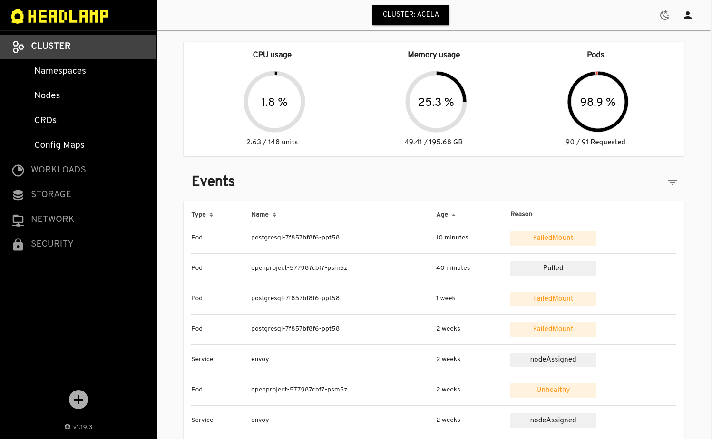
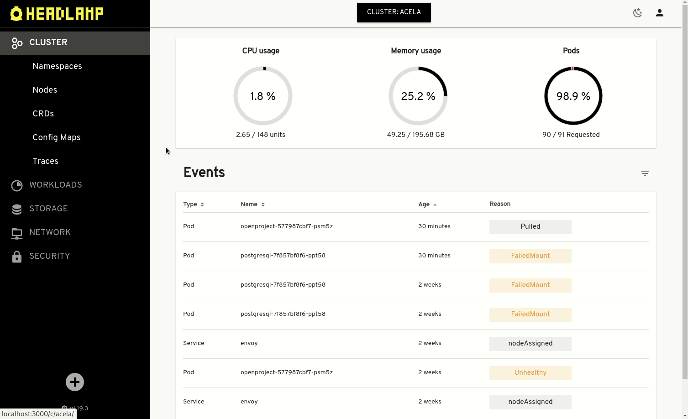
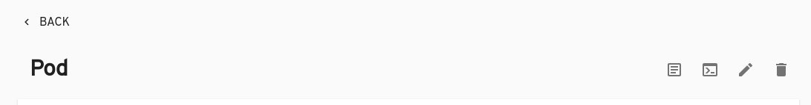
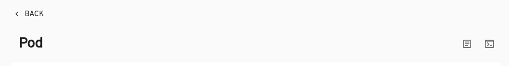
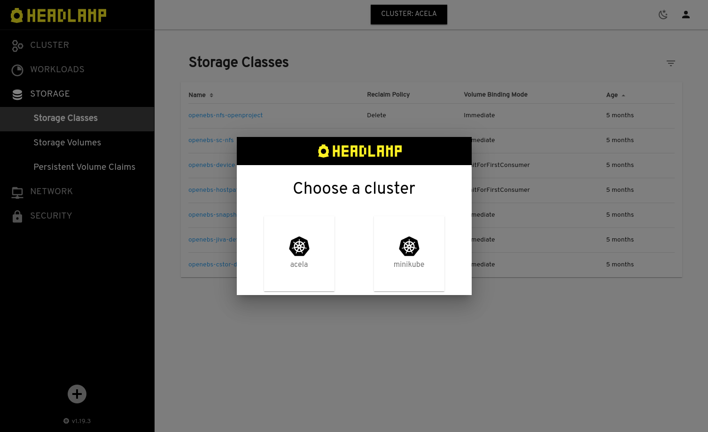

If you’ve ever seen a Kubernetes demo, it probably involved a terminal and someone typing commands using kubectl and arcane yaml configuration files. This might be a powerful workflow for experts, but in an age when everything has a slick web interface, it is not the most accessible user experience. It **steepens the learning curve** for those new to Kubernetes, and **presents a barrier** to occasional users.

Of course, there are several graphical user interfaces available for Kubernetes, including the _Kubernetes Dashboard_ project that is part of upstream Kubernetes itself. However, when we researched the landscape, we couldn’t find a solution that covered everything we were looking for. Specifically, our criteria were:

- 100% open source
- Actively maintained
- Generic, in the sense of not being tied to a specific vendor’s Kubernetes distro
- Modular and extensible
- Clean, modern user interface
- Implemented using a stack that was familiar to our development team (Go, Javascript/Typescript, React)
- An interactive UI that allows read-write operations, not just a read-only dashboard
- Multi-cluster.

Despite the good number of alternatives, the reality is that none of the solutions we tested at the time really matched all the points in our criteria or was a good base to start from. So, in the time-honored tradition, we decided to build one ourselves…

# Introducing Headlamp

Today, I am **proud to announce the general availability of a new UI for Kubernetes**: [Headlamp](https://github.com/kubernetes-sigs/headlamp).

Headlamp is a generic and extensible Kubernetes UI that meets the criteria mentioned above. Of course, coming from Kinvolk, it is 100% open source. We hope many Kubernetes community members will not just enjoy using Headlamp, but also contribute back to the project.

Let’s take a quick spin through some of its core features.

## Extensible UI

We want Headlamp to be used for as many different use-cases as possible. That includes not only novice Kubernetes users, but also experienced operators, as well as Kubernetes vendors with very different needs. Often, particularly for UI projects, such a breadth of use cases can only be addressed by downstream users maintaining their own fork. But keeping forks up to date becomes more challenging the deeper the changes are.

A solution to this problem is to have a plugin system. So Headlamp supports out-of-tree UI plugins: Javascript files that are loaded by Headlamp's backend and passed to the client which dynamically loads them.

This opens up Headlamp to innovation, **fostering a wealth of new functionality**. For example, if you want to add a button to the Pod details view that will redirect the user to a service showing how much the Pod is costing to operate, that should be easy to implement.

We see Headlamp’s plug-in capabilities as a great opportunity for the community. We are eager to collaborate with others who want to develop new Headlamp plugins, or enhance the plugin system itself to support other use-cases.

### Traceloop

As an **example of the power of the plug-in system**, and an incredibly useful tool in its own right, we have developed a [Headlamp plugin for the traceloop gadget](https://github.com/kinvolk/lokomotive-web-ui/tree/master/plugins/ig-traces) of our [Inspektor Gadget](https://github.com/kinvolk/inspektor-gadget) project.

When Inspektor Gadget is installed in a cluster and the traceloop gadget is enabled, it **records all syscalls from a pod** into a ring buffer. This buffer can be seen in real-time as the pod is running, allowing a lens into what the pod is doing right now, but is also saved for terminated pods. This allows operators to see what caused a crash, after it happens – like a “flight data recorder” for your Kubernetes apps.

## Role-aware UI

One problem with many read-write (CRUD) user interfaces is that they are not aware of underlying access controls. For example, displaying the update/delete buttons is misleading if the user has actually no permissions to modify the resource. So Headlamp checks Kubernetes RBAC settings and displays only those controls whose actions can be performed. So, if the user does not have permission to edit a resource, the edit button will not be displayed.

This results in a much better UX, because it is obvious to the operator what actions are available based on their permissions at the time. In particular, this is great for situations where time-limited credentials are granted to operators (e.g. temporary deletion permissions on a resource).

Pod when the user has update/delete permissions

Pod when the user has no update/delete permissions

## Design / User Interface

We wanted Headlamp's design to be as **clean and modern** as possible, yet without breaking with a more "traditional" Kubernetes UI or dashboard style. For example, we think that showing a familiar table-based view is very helpful, and we hope other visualizations, such as a graph-based representation of the cluster, can be implemented through plugins.

To implement Headlamp’s frontend, we chose to use React with the [Material UI](https://material-ui.com/) library, because it is modern, clean, and is well maintained with a large user community. It also has the advantage that it is the same technology stack that we use in our [Nebraska](https://github.com/kinvolk/nebraska) project, enabling sharing of expertise and resources, and supporting a consistent UI across all our products.

## Desktop vs In-cluster

Most Kubernetes UIs can be categorized as either a hosted (often in-cluster) backend, such as the original Kubernetes Dashboard, or a local desktop application, such as VMware’s [Octant](https://github.com/vmware-tanzu/octant) project.

Both approaches have their advantages and disadvantages. For example, when run as a hosted application, it's very simple to just share a URL with users, and have them log in through OIDC. It's available "everywhere", and it’s easy to keep it up-to-date with the cluster version. Conversely, with a desktop application, there’s no need to host the UI application, keeping things more isolated, but the burden of keeping the app up to date falls on the user.

With Headlamp, you **don’t have to choose** between these two approaches, as we support both. It can be easily **hosted in-cluster** by using/adapting the YAML files we provide, or **installed locally** on Linux, Mac, and Windows.

## Multi-cluster support

Most Kubernetes deployments involve multiple clusters, even if that’s just to separate a development from a production environment. Thus, Headlamp **allows you to access all your clusters** - with the exact method depending on whether you’re running as a hosted, or a local (desktop), application.

When run locally, Headlamp will read the kube config and display the contexts available there, allowing the user to change when needed just by setting the local environment variable to the appropriate cluster.

The way the multi-cluster support works is straightforward: it creates a proxy for each configured cluster, and redirects requests from the UI (with the Kubernetes API calls) to the right cluster address. Shout-out here to the [K8dash](https://github.com/indeedeng/k8dash) project, whose request/API management modules we reused in the development of Headlamp.

It's also possible to mix this with running in-cluster, though this does require the cluster running the application to have API access to the other configured clusters.

# Relationship to Lokomotive Kubernetes

You may be aware that Kinvolk also has a Kubernetes distribution, [Lokomotive](https://kinvolk.io/lokomotive). While Headlamp is of course used within Lokomotive as the basis for its web user interface, it is important to note that these are separate and independent projects. True to our goal of being independent of any particular distro, **Headlamp is designed to support any conformant Kubernetes cluster**.

# Shine Headlamp on your cluster!!

It’s **easy to try out Headlamp**: just apply the deployment manifest to your cluster and point your browser to the Headlamp service, or download and install the desktop application for Windows, Mac, or Linux. For details, see the [documentation](/docs/latest/installation).

Headlamp is fully open source, released under the Apache 2.0 terms and, as mentioned above, we created it to be a generic and vendor-independent Kubernetes UI that we hope can suit many use-cases. So we encourage anyone interested to take part.

If you want to participate, please check out our [contribution guidelines](/docs/latest/contributing).

**We hope you enjoy Headlamp!**
