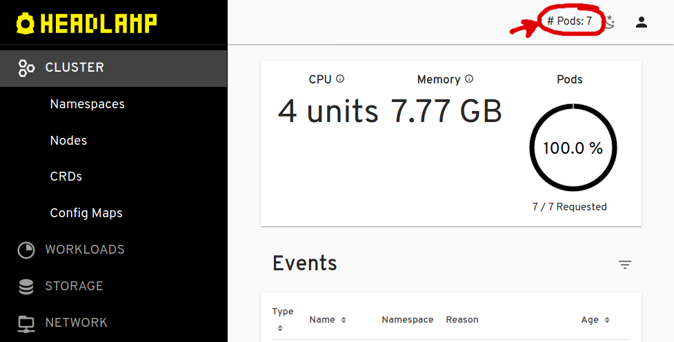
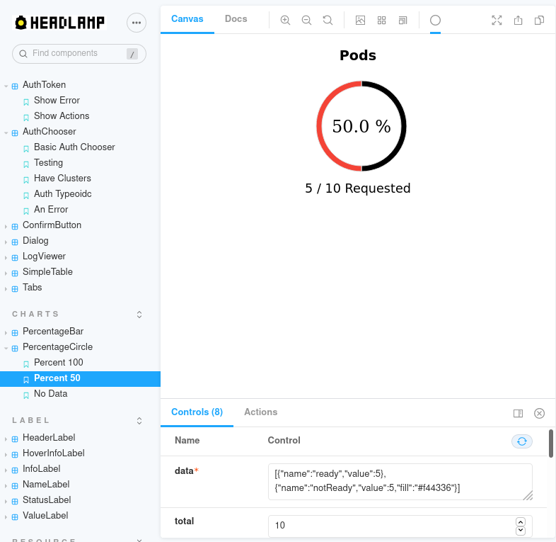
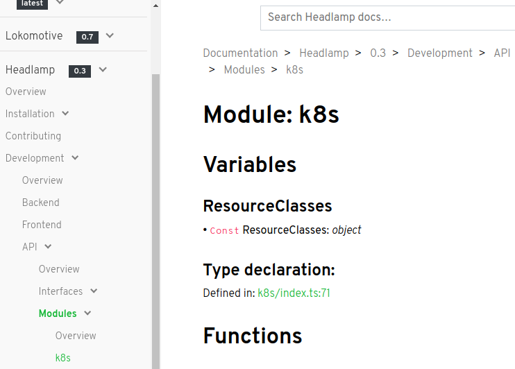

We released [Headlamp](/) (a generic Kubernetes web UI) last November with one of its core features being "frontend plugins". These are extensions whose purpose is to offer extra functionality that is not available in Headlamp by default.

Plugins are written in Typescript (or Javascript), compiled into a single module using [webpack](https://webpack.js.org/), and loaded by Headlamp’s backend which makes them available for the frontend to dynamically load.



The process above works well and is transparent to Headlamp’s users. However, the development of those plugins meant different workflows when it came to developing them and to building/shipping them, ultimately requiring developers to move the plugins around, into the Headlamp's source tree for hot-reload and debugging, and outside into a "plugins folder" for development. It quickly became clear that this was not the best development experience we could offer, and so we've been working hard to greatly improve the workflow of developing plugins for Headlamp.

# Simplifying the plugin development workflow

To greatly simplify the plugin development story, we leveraged Headlamp's plugin deployment mechanism instead of creating a completely different way of developing a plugin vs deploying it. i.e. the new plugin development workflow consists in continuously making the plugins available as if they were deployed and loading that list of plugins, as well as the frontend, when there are changes.

For making the plugin creation and programming easier, we revamped the `@kinvolk/headlamp-plugin` package we had already since last year. Now this command is able to start a fresh plugin, rebuild/redeploy them on every change, and prepare the plugins for shipment/production.

```bash
    npx @kinvolk/headlamp-plugin create headlamp-myfancy
    cd headlamp-myfancy
    npm run start
```

# Development on desktop Headlamp

Since plugins were initially developed with the “in-cluster” deployments in mind, for different vendors to provide a unique Kubernetes web UI to their users, Headlamp’s desktop apps did not support the use of plugins.

With this new [0.3.0 version](https://github.com/kubernetes-sigs/headlamp/releases/tag/v0.3.0)
however, the Headlamp desktop app has full support for plugins. It now looks for changes and automatically reloads the UI as well, if a plugin is changed. This effectively means that plugin developers no longer need to clone Headlamp's repository and build it just for developing plugins, as using one of the desktop applications works for loading and seeing any changes throughout the plugins' development.

# How to make a Headlamp plugin

Instead of duplicating the [How to Create a Plugin](/docs/latest/development/plugins/how-to/) section we have in our documentation, we thought we’d create a short video to illustrate how you can develop a Headlamp plugin:

<iframe width="100%" height="415" src="https://www.youtube.com/embed/vyki8c6AkeE" title="YouTube video player" frameborder="0" allow="accelerometer; autoplay; clipboard-write; encrypted-media; gyroscope; picture-in-picture; web-share" referrerpolicy="strict-origin-when-cross-origin" allowfullscreen></iframe>

# Development Resources

We can break down the development resources for a Headlamp plugin into: examples, a component development environment (storybook), and the development API.

## Examples

As developers, we are used to learning by looking into others’ code. So if you are also like that, you can take a look at the [plugins examples folder](https://github.com/kubernetes-sigs/headlamp/tree/main/plugins/examples) we have as part of Headlamp’s repository, as well as the [plugins](https://github.com/kinvolk/lokomotive-web-ui/tree/master/plugins) we have as part of the Lokomotive Web UI.

## A component playground

To make it easier to discover Headlamp’s components and how they work or how they can be used inside of plugins, we have set up a “[Storybook](https://storybook.js.org/)”. This lets developers search for components and play with them, changing their inputs to see what they do.

Plugins are not limited to using Headlamp GUI components, they can also use a large selection of [Material UI](https://material-ui.com/) components, but using Storybook is a great way to learn about Headlamp’s internals, for plugin use or for contributing changes to Headlamp itself. Check out the documentation on how to run the [Headlamp storybook](/docs/latest/development/frontend/#storybook).



## Detailed API reference

To help with the plugin development, or indeed with understanding Headlamp’s internals, we have started on a detailed Headlamp’s API reference guide. Classes, functions and other things are listed with their respective types.

You can read the [Headlamp API reference](/docs/latest/development/api/) integrated into the project’s developer documentation.



# Shipping plugins

Once plugins are ready to be deployed in production (for in-cluster deployments), they need to be extracted into a “plugins directory”. To make that easy, our already known _headlamp-plugin_ tool now has a new command to extract one or more plugins to a plugins directory.

```bash
    npx @kinvolk/headlamp-plugin extract your-plugins path/to/.plugins
    npx @kinvolk/headlamp-plugin extract your-plugins/headlamp-myfancy path/to/.plugins
```

Be sure to check more details on deploying plugins in the “[Building and Shipping plugins](/docs/latest/development/plugins/building/)” part of the documentation.

# Your plugins

We built the plugins capability for enabling use-cases beyond what we perceive as core to the experience of managing Kubernetes, and are looking forward to seeing what others can do with it. Moreover, we are also planning on having an official list of plugins soon. \
So do let us know what plugins you are working or interested in working on! Or tell us what we need to improve to support your use-case through plugins. You can reach us at the [#headlamp](https://kubernetes.slack.com/messages/headlamp) channel in the Kubernetes Slack, or file an issue on the [Headlamp repo](https://github.com/kubernetes-sigs/headlamp).

# … but that’s not all!

While this article is about the new plugin development experience, we do have other new features in this Headlamp 0.3.0 release. For example, we now support ARM64 Apple Silicon (M1), a new YAML view for resources, and more! So make sure to also check out this new version's [release notes](https://github.com/kubernetes-sigs/headlamp/releases/tag/v0.3.0).
