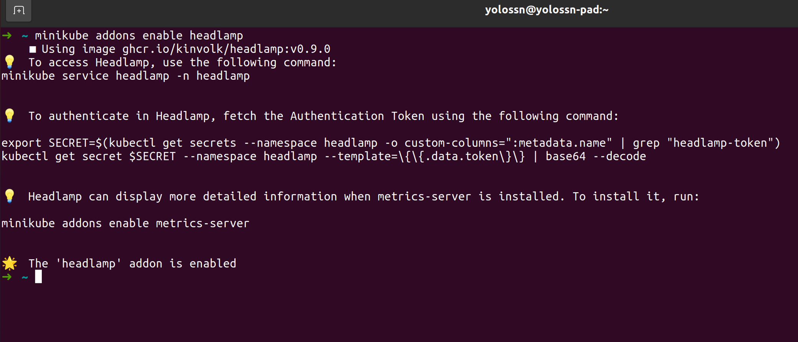
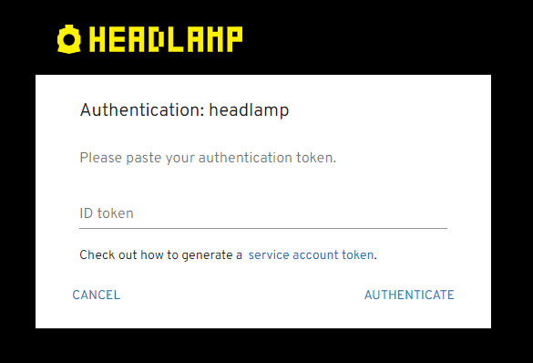
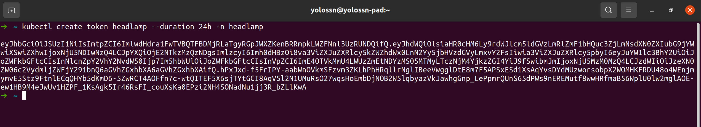
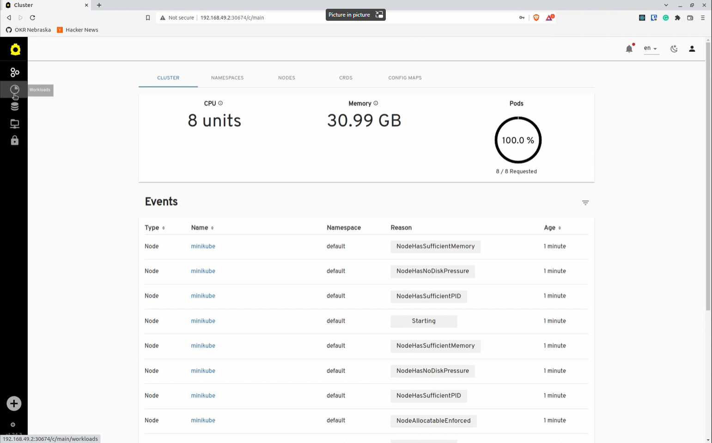

[Minikube](https://minikube.sigs.k8s.io/) makes it easy to learn and develop for Kubernetes locally. It allows users to get Kubernetes up and running on a single machine very quickly, and its **addons** make it easy to enable more functionality or deploy applications. This makes Minikube ideal for new Kubernetes users, or for quick tests/deployments. [Headlamp](https://github.com/kubernetes-sigs/headlamp#readme) is therefore a great complement for Minikube. After all, as a graphical user interface, Headlamp offers a more guided way to interact with Kubernetes than the typical command-line experience.

So, we added a [Headlamp addon for Minikube](https://minikube.sigs.k8s.io/docs/handbook/addons/headlamp/)!

In this blog post we will cover how to install Minikube and get started with Headlamp using the addon.

## Installing Minikube

We have to first install Minikube. For that, please follow the [official instructions](https://minikube.sigs.k8s.io/docs/start/) for your platform. For this example, we have installed Minikube 1.26.1 which uses Kubernetes 1.24.3.

## Enabling the Headlamp addon

With Minikube successfully installed, the next step is to start it, which will get any needed resources and create a Kubernetes cluster locally.

```bash
minikube start
```

Once we have a cluster running, you can enable the Headlamp addon in Minikube by running the following command:

```bash
minikube addons enable headlamp
```



## Accessing Headlamp

Now that Headlamp is deployed in Minikube, you can access it by running the following command:

```bash
minikube service headlamp -n headlamp
```

This command allows the user to access the service running inside the cluster and at this point you should be redirected to the Headlamp authentication page in your default browser. If not, open the URL displayed by the command.

## Authenticating in Headlamp

Headlamp requires you to authenticate using a service account token to securely access the resources in your Kubernetes cluster, and will prompt you for pasting the token like the following screenshot shows.



To get this token, follow the instructions that were printed after enabling the Headlamp addon. If that token gets expired, you can use the following command to generate a new one:

```bash
kubectl create token headlamp --duration 24h -n headlamp
```



The generated token is valid for 24 hours and Headlamp takes care of automatically refreshing the token before it expires.

If it all went well, you should see an overview of the cluster (as the screenshot below) and be able to navigate through Headlamp's UI.



Here is a video of the whole process of installing Minikube and running Headlamp through the new addon:

<iframe width="100%" height="415" src="https://www.youtube.com/embed/IFAVnr410iE" title="YouTube video player" frameborder="0" allow="accelerometer; autoplay; clipboard-write; encrypted-media; gyroscope; picture-in-picture; web-share" referrerpolicy="strict-origin-when-cross-origin" allowfullscreen></iframe>

<br/><!-- Otherwise this paragraph gets very close to the Youtube embed -->

We hope the Minikube addon for Headlamp makes it easy for you to get started on experimenting with Kubernetes and Headlamp.
