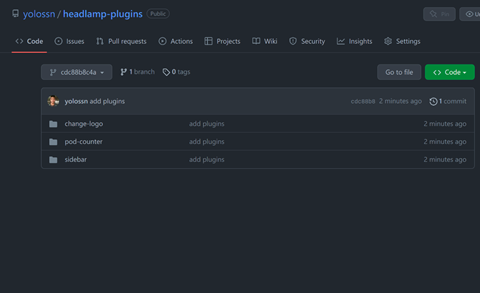
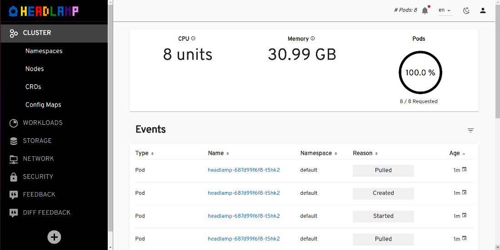

One of [Headlamp](/)'s goals is to be an adaptable Kubernetes UI for different users and use-cases, and this can be achieved through its plugin system.

Moreover, Headlamp can be run as a desktop application or as an in-cluster web application, and both ways of running it support plugins. Headlamp’s documentation already covers how to develop and run plugins in the desktop, but there are some additional considerations if you want to deploy Headlamp in a Kubernetes cluster together with plugins.

In fact, running Headlamp with plugins in-cluster is a very compelling use-case for corporate users or vendors: it allows them to offer a Kubernetes UI with a custom user experience for their users with a simple way to distribute it, update, and access it, as that will be a responsibility for the provider/company.

Hence, in this blog post we will walk you through how to manage and deploy Headlamp with plugins in the in-cluster mode.

## What are Headlamp plugins?

Headlamp uses **frontend plugins**, which are JavaScript bundles that are loaded by the frontend. You can read about how to use or develop plugins in our plugin [development documentation](/docs/latest/development/plugins/building/). This article is about _deploying_ -- rather than _developing_ -- plugins.

We will be using 3 plugins from the [examples](https://github.com/headlamp-k8s/headlamp/tree/main/plugins/examples) we have in Headlamp’s repository. Those are the Pod Counter, Change logo and Sidebar. Headlamp expects the plugins to be built and placed in the following directory structure to load them:

```
<plugins-dir>
├─ change-logo
  └─ main.js
├─ pod-counter
    └─ main.js
├─ sidebar
    └─ main.js
```

We will use [init containers](https://kubernetes.io/docs/concepts/workloads/pods/init-containers/) to copy the plugin files to a volume and then mount the same volume to the Headlamp container, which loads the plugin files.

## Building a plugins container image

A best practice for managing plugin deployments is to ensure they are version controlled. To do this, let's create a Git repository for the plugins code and add the plugins as shown below.



To get a container image with the plugins, we create a docker file that builds the plugins using the headlamp-plugins [package](https://www.npmjs.com/package/@kinvolk/headlamp-plugin).

The following docker file uses multi-stage build: the latest node image is used as base image to build the plugins and then it copies the built plugins to a basic alpine image.

```Dockerfile
FROM docker.io/library/node:16.4 as builder

WORKDIR /headlamp-plugins

COPY ./ /headlamp-plugins/

RUN mkdir -p /headlamp-plugins/build

# Build the plugin
RUN npx @kinvolk/headlamp-plugin build /headlamp-plugins

# Extract the built plugin files to the build directory
RUN npx @kinvolk/headlamp-plugin extract /headlamp-plugins/ /headlamp-plugins/build


FROM alpine:latest

# Copy the built plugin files from the base image to /plugins directory
COPY --from=builder /headlamp-plugins/build/ /plugins/

CMD ["/bin/sh -c 'mkdir -p /build/plugins && cp -r /plugins/* /build/plugins/'"]
```

For the sake of this example, we will use GitHub Actions and the Github Container Registry to build and host the container image, feel free to use tools of your choice.

The following GitHub Action spec builds the container image on every code push to the main branch and pushes the container image to the GitHub container registry.

```yaml
name: Build docker image

on:
  push:
    branches:
      - main

jobs:
  build:
    name: build docker image
    runs-on: ubuntu-latest

    steps:
      - name: Check out code
        uses: actions/checkout@v2

      - name: setup docker
        uses: docker-practice/actions-setup-docker@master

      - name: build docker image
        run: |
          docker build -t ghcr.io/<Your-Github-Org-or-Username>/headlamp-plugins:latest ./

      - name: login to GitHub Container Registry
        uses: docker/login-action@v1
        with:
          registry: ghcr.io
          username: ${{ github.actor }}
          password: ${{ secrets.GITHUB_TOKEN }}

      - name: push docker image
        run: |
          docker push ghcr.io/<Your-Github-Org-or-Username>/headlamp-plugins:latest
```

Note: In the above file replace `<Your-Github-Username>` with your Github username.

## Deploying Headlamp with plugins

We will use the Headlamp Helm chart to deploy Headlamp with the container image we built as an init container.

Add the Headlamp Helm chart using the following command

> helm repo add headlamp [https://headlamp-k8s.github.io/headlamp/](https://headlamp-k8s.github.io/headlamp/)

The following values.yaml configures the Helm chart to create a persistent volume and mount to the path `/build/plugins`. t also configures an init container that mounts the `headlamp` volume and copies the plugins to the `/build/plugins` folder. The same volumeMount is used in the `headlamp` container and the `pluginsDir` is set to `/build/plugins`.

```yaml
initContainers:
  - name: "headlamp-plugins"
    image: ghcr.io/<Your-Github-Org-or-Username>/headlamp-plugins:latest
    imagePullPolicy: Always
    command:
      [
        "/bin/sh",
        "-c",
        "mkdir -p /build/plugins && cp -r /plugins/* /build/plugins/",
      ]
    volumeMounts:
      - name: "headlamp-plugins"
        mountPath: "/build/plugins"

persistentVolumeClaim:
  enabled: true
  accessModes:
    - ReadWriteMany
  size: 1Gi

volumeMounts:
  - name: "headlamp-plugins"
    mountPath: "/build/plugins"

volumes:
  - name: "headlamp-plugins"
    persistentVolumeClaim:
      claimName: "headlamp"

config:
  pluginsDir: "/build/plugins"
```

Note: In the above file replace `<Your-Github-Username>` with your Github username.

Usually, it is a recommended practice to add this YAML to a git repository to version control the changes. One can also setup pipelines to apply the values everytime there is a change by following gitops practices, but for now, let’s use the following command to install the helm chart with the configured values.

```bash
helm install headlamp headlamp/headlamp -f=./values.yaml
```

Now that we have installed Headlamp along with plugins, let’s access it to see the plugins in action. For that, we expose Headlamp with a port-forward, as such:

```bash
kubectl port-forward svc/headlamp 8000:80
```



## Conclusion

Deploying Headlamp with plugins can be very valuable for operators/vendors who want to provide a tailored but consistent UI to their users -- after all, users won’t even realize there are plugins running in the Headlamp deployment they are accessing. We hope this guide will help you accomplish a great user experience for yourself or other Kubernetes users.

If you have questions or suggestions about this strategy of deploying Headlamp with plugins, let us know in the [community Slack](https://kubernetes.slack.com/messages/headlamp).
