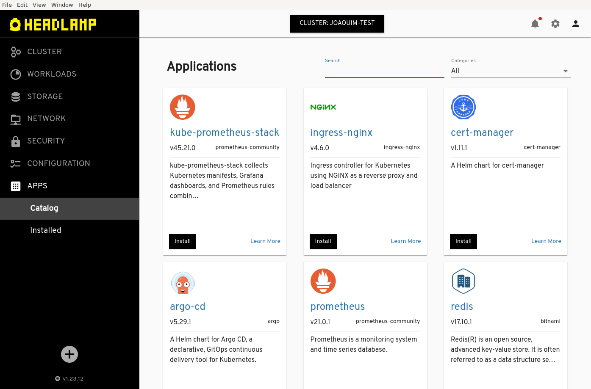

Our goal with Headlamp has always been to create a fully featured and extensible UI that helps streamline the management of Kubernetes clusters. Today, we are introducing the next phase in our journey.

<!--truncate-->

## Headlamp Base and Headlamp 

Up until the last release ([0.16.0](https://github.com/headlamp-k8s/headlamp/releases/tag/v0.16.0)), Headlamp shipped as a basic Kubernetes Web UI that could be extended by creating plugins. That has served as a very clean and generic base, which is a great building block for vendors. Yet, we feel like we can go beyond this base and make Headlamp a more compelling experience for many users, while keeping its flexibility and extensibility. Thus, from now on, we are taking a more comprehensive approach: Starting with the [0.17.0](https://github.com/headlamp-k8s/headlamp/releases/tag/v0.17.0) release, Headlamp ships with plugins that extend the base Kubernetes UI experience. This transforms the project into two concepts:

1. **Headlamp Base:** This is a "vanilla" build, that does not include any plugins and can be used as a foundation to build your own Kubernetes Web UIs. This version can easily be built by following the [build instructions](/docs/latest/development/#build-headlamp-base-headlamp-without-any-plugins).
2. **Headlamp:** This is what we package as a release for users and includes Headlamp Base plus plugins that provide a more complete Kubernetes web UI experience.

Both versions are open, free, and downloadable/installable just like Headlamp has always been. And plugins that we ship with Headlamp will all be open source. So, to be very clear, this is _not_ an "open core" approach.

This change allows us to deliver our vision of what a modern, compelling, and useful Kubernetes user experience should be, without compromising the flexibility that Headlamp has always offered. If anything, as we integrate more functionality into plugins, it allows for easier tuning of Headlamp-based UIs for vendors and users.

## Introducing the App Catalog Plugin 

The first plugin we are introducing as a part of this is the App Catalog plugin based on Helm charts. This plugin will allow you to easily discover, deploy, and manage applications on your Kubernetes cluster, providing a more seamless experience. We believe having this functionality is especially useful for many users, hence its inclusion in Headlamp. Yet, by having it as a plugin, it emphasizes the philosophy that those users/vendors who do not want this functionality, can simply opt to use Headlamp Base without it.

## Customizing Your Kubernetes Web UI Experience 

For those looking to build custom Kubernetes Web UIs, this new approach means you can start with Headlamp Base and add any additional plugins from the Headlamp project or create your own custom plugins. This way, you will be able to craft the perfect Kubernetes Web UI, tailored to your specific requirements.

We have a new [plugins](https://github.com/headlamp-k8s/plugins) repository where we are maintaining the plugins we officially ship/recommend, and you can find the App Catalog plugin mentioned above in there.

As we continue to build out our vision of what a Kubernetes UI should be, expect more plugins to be added to that repository. So, stay tuned for more information on upcoming plugins and features!

## Embracing Open Source and Open Development 

The Headlamp team strongly believes in the power of open source software and an open development model. We are convinced that this approach benefits both the project and its users. By fostering collaboration, transparency, and innovation, we can create a vibrant community that will continue to push the boundaries of what a Kubernetes UI can achieve.

We hope you join us in this exciting new chapter for the Headlamp project and help us shape the future of Kubernetes UIs. We are also looking forward to hearing from you, either on our [Headlamp channel](https://kubernetes.slack.com/messages/headlamp) in the Kubernetes Slack instance, or on [Github](https://github.com/headlamp-k8s/headlamp). Whether you're a developer looking to contribute, a vendor looking to build atop Headlamp, or a user seeking a more powerful Kubernetes management experience, we welcome you to be part of this journey.

Together, let's make Kubernetes management more accessible, efficient, and enjoyable for everyone.
