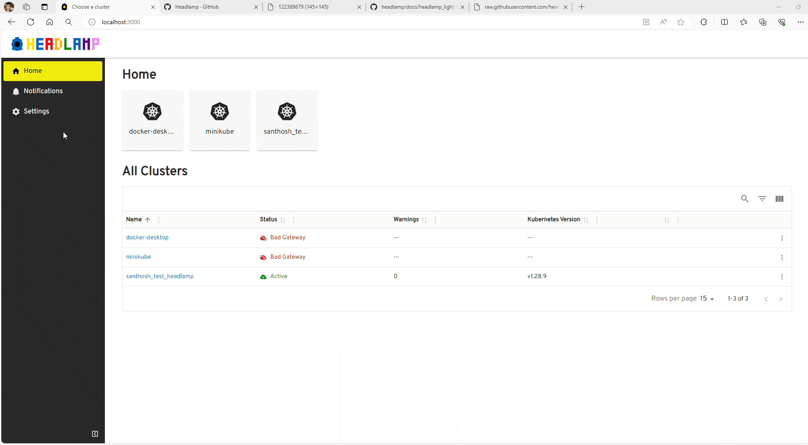

Headlamp's plugin system, while robust, lacked user customization for any options those plugins had to offer. This required developers to create their own way to customize the plugins, or left users with non-configurable plugins. To bridge this gap, Headlamp has introduced Plugin Settings, offering a consistent and unified option for developers to present customization options for their plugins. This way, users can configure the plugins to meet their own needs.

<!--truncate-->

## Adding settings to a plugins

Let's dive into the technical implementation of integrating Plugin Settings into an existing example, the change-logo plugin. This plugin is designed to override the Headlamp logo. Let’s say we want to make the logo image configurable directly from the UI. We can use the Plugin Settings for this!

### Step-by-Step Integration Guide

#### Step 1: Create Plugin Setting Component

```tsx
function Settings(props) {
  const { data, onDataChange } = props;

  return (
    <Box width={"80%"}>
      <TextField
        fullWidth
        helperText="Enter the logo URL"
        onChange={(event) => {
          onDataChange({ logoURL: event.target.value });
        }}
        defaultValue={data?.logoURL}
        variant="standard"
      />
    </Box>
  );
}
```

The Settings component is responsible for rendering an input field where the user can enter the URL of the new logo. When the component is registered to Headlamp, it receives two props: data and onDataChange. The data prop contains the current state of the settings, and the onDataChange prop is a callback function used to update this state.

#### Step 2: Registering the Settings component

```typescript
import { registerPluginSettings } from "@kinvolk/headlamp-plugin/lib";

registerPluginSettings("change-logo", Settings, true);
```

In the [registerPluginSettings](https://headlamp.dev/docs/latest/development/api/modules/plugin_registry/#registerpluginsettings) function:

- The first argument (name) is the name of your plugin. In this example, it's 'change-logo'.
- The second argument (component) is your settings component, which in this case is the Settings function component we defined earlier.
- The third argument (displaySaveButton) is optional and specifies whether to display a save button for users to save their settings. We've set it to true in this example to include the save button.

This `registerPluginSettings` function call acts as a bridge between your plugin's settings component and Headlamp's plugin system, ensuring that your plugin setting is integrated in Headlamp plugin settings view.

##### Handling Settings Saving

When registering the settings component using the `registerPluginSettings` function, developers can choose how saving the new configuration is handled. This is determined by the `displaySaveButton` argument of the function, which specifies whether to display a save button for users to save their settings.

##### Saving with Save Button

By setting the `displaySaveButton` argument to true, a save button is included in the Plugin Settings UI. This allows users to easily save their changes, with the data being passed to Headlamp for storage. This approach is convenient for most use cases where users expect a final confirmation by the user, e.g. asking for options to be switched on/off which should take effect only after the user presses "save".

##### Programmatic Saving

Alternatively, setting the `displaySaveButton` argument to false removes the save button from the UI. In this scenario, developers are responsible for programmatically handling settings saving. This method is beneficial in cases such as auto-save functionality or when settings depend on dynamic values that require custom saving logic.

By leveraging this option, developers can tailor the settings saving process to their plugin's specific requirements.

#### Step 3: Using the configuration in the plugin

```tsx
import { ConfigStore } from "@kinvolk/headlamp-plugin/lib";

function SimpleLogo(props: AppLogoProps) {
  const { logoType, className } = props;

  const store = new ConfigStore<{ logoURL: string }>("change-logo");
  const useConf = store.useConfig();
  const config = useConf();

  return config?.logoURL ? (
    <Avatar src={config?.logoURL} alt="logo" className={className} />
  ) : (
    <>#Default Logo goes here</>
  );
}
```

The `SimpleLogo` component uses the ConfigStore to fetch the logo URL from the plugin settings and display it. If a custom logo URL is set, it shows the custom logo; otherwise, it displays a default placeholder.

## Demo

You can access the plugin settings by following these steps: First, go to the Home view and click on the Settings. Then, select Plugins and find the plugin you want to configure. Click on the plugin name to open the plugin settings.

The component passed to `registerPluginSettings` appears in the Plugin Settings Detail view. Then, all you need to do is enter the logo URL and click Save. The new logo will be displayed in the Headlamp header.

Here is a GIF demo of the change-logo plugin with the new settings:



## Conclusion

The Plugin Settings functionality in Headlamp opens a wide variety of customization opportunities for plugins and addresses a highly requested gap experienced by Headlamp plugin developers. We are looking forward to seeing how plugin developers will use this feature, so if you use it, let us know what you think! Feedback helps us make things better for everyone.
