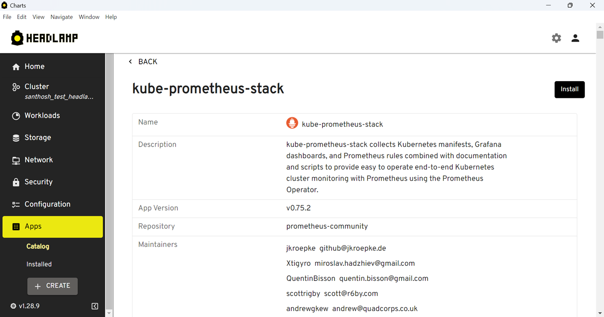
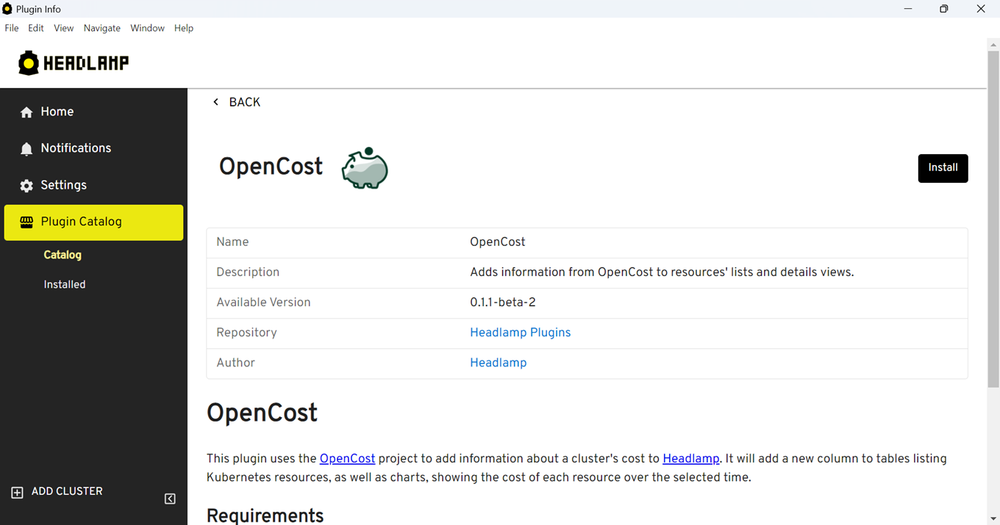
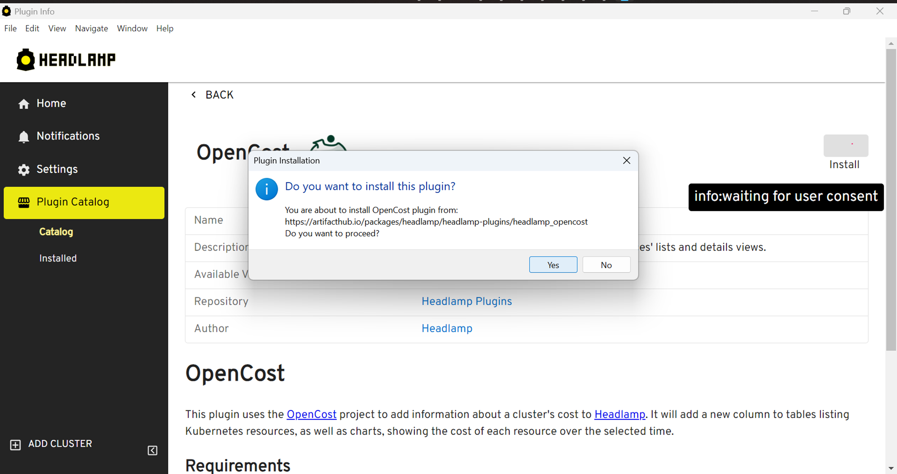
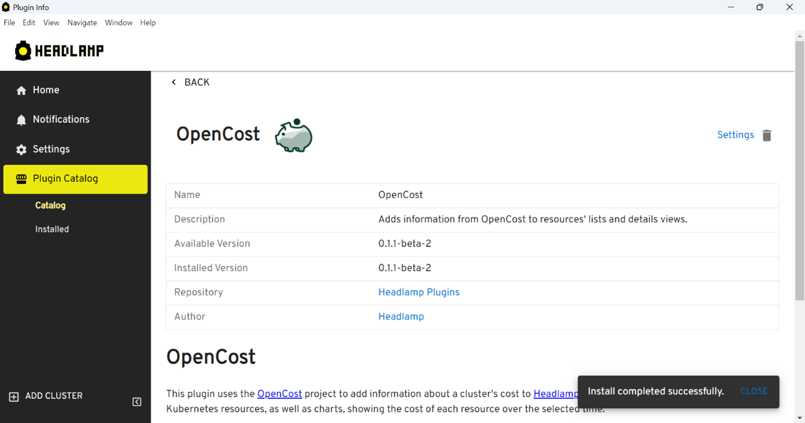
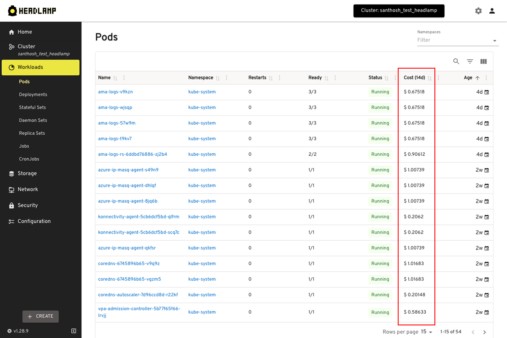
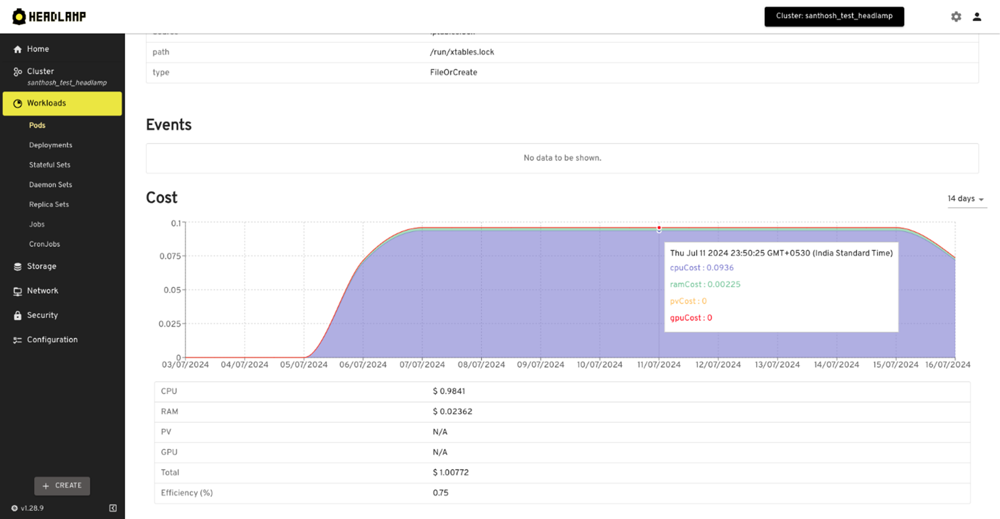

[OpenCost](https://www.opencost.io/) is one of CNCF's leading open-source projects that offers real-time native cost monitoring for Kubernetes environments, providing visibility to developers and companies on the costs linked to their cloud-native applications. With OpenCost, one can trace the costs of single workloads, namespaces, and even particular labels in your Kubernetes cluster. The continuous granular cost visibility that OpenCost provides help in effectual usage of resources and better budgeting.

<!--truncate-->

Given how useful OpenCost is, we created a [Headlamp](https://headlamp.dev/) plugin for OpenCost to help Headlamp users track their cluster resource costs. This integration aims to solve the visibility problem between cost and cluster management, enabling developers to make more informed decisions.

:::note
OpenCost must be installed with Prometheus metrics export, for the OpenCost plugin to display the data.
:::

Here is a quick video explaining the whole process:

<iframe width="560" height="315" src="https://www.youtube.com/embed/J-jc0X8xk28?si=w_tmQW2cZgW9660k&cc_load_policy=1" title="YouTube video player" frameborder="0" allow="accelerometer; autoplay; clipboard-write; encrypted-media; gyroscope; picture-in-picture; web-share" referrerpolicy="strict-origin-when-cross-origin" allowfullscreen></iframe>

## Installing OpenCost in the cluster

If you don’t have Prometheus and OpenCost installed in your cluster and you are using Headlamp as a desktop app, you can use the App Catalog to install them. This can be done by accessing the Apps from the sidebar, after you enter your cluster in Headlamp, look for the Prometheus app that is distributed by the prometheus-community, click install and follow the instructions.



Alternatively, you can install it by running the following commands.

```bash
helm repo add prometheus-community https://prometheus-community.github.io/helm-charts
helm install prom prometheus-community/kube-prometheus-stack
```

Installing OpenCost:

```yaml
opencost:
  prometheus:
    internal:
      enabled: true
      namespaceName: <Prometheus-Namespace>
      port: 9090
      serviceName: <Prometheus-Service>
```

:::note
Replace `<Prometheus-Namespace>` and `<Prometheus-Service>` with the namespace in which you have installed prometheus and prometheus service name.
:::

## Installing KubeCost plugin from the plugin Catalog

1. In Headlamp’s home screen click on Plugin Catalog > Catalog.
2. Click the OpenCost plugin from the list of plugins that are displayed.
3. Click the Install button on the top right.







## Visualizing OpenCost information

After OpenCost is correctly installed and configured, its information will appear integrated in various parts of the Headlamp UI, for example, tables listing resources in the workload related views (pods, deployments, etc.) will now show a column with the cost of running that resource.



Similarly, at the bottom of the details view of each individal resource, there will be a chart showing the resource’s cost over time.



## Configuring how data is displayed

OpenCost's settings (under Settings > Plugins > OpenCost) provide options to adjust how the data is shown in the UI, ie. what currency symbol to be used, or timespan for which the cost has to be displayed. This way, users can easily adapt how OpenCost is displayed for them.

## Conclusion

We believe this plugin is useful for many users who want to keep their costs monitored close to their Kubernetes resources. We are looking forward to receiving feedback and contributions on how we can make the UI even more useful with OpenCost and other CNCF tools, so reach out to us and get involved in Headlamp!
