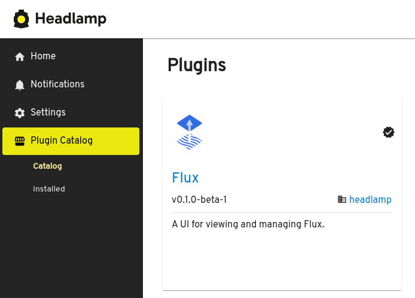
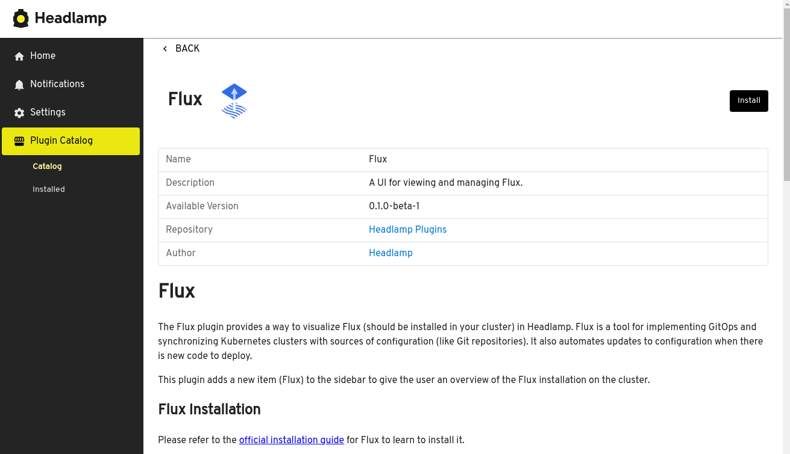

In the world of Kubernetes, managing configurations and deployments can quickly become overwhelming. Even with graphical user interfaces (GUIs) like Headlamp, which aim to simplify navigation and management, the reliance on manual changes can lead to errors and inconsistencies. This practice, often referred to as **ClickOps**, lacks the traceability necessary to prevent configuration drift, where the actual state of the system diverges from its intended state.

<!--truncate-->

## Why GitOps Matters 

In stark contrast to ClickOps, **GitOps** harnesses the power of version control to ensure that every change is documented, reviewed, and easily reversible. By storing your system’s desired state in a Git repository, GitOps provides a single source of truth. This approach not only enhances security and auditability but also simplifies rollback and disaster recovery processes.

GitOps transforms the way teams manage their infrastructure by:

* **Ensuring Consistency:** Every change is tracked, reducing the risk of discrepancies between environments.
* **Facilitating Collaboration:** Teams can work together more effectively, as all modifications are visible and can be reviewed.
* **Streamlining Recovery:** In the event of an issue, reverting to a previous state is straightforward, minimizing downtime.

## Headlamp's Flux Plugin: Bridging the Gap 

[Flux](https://fluxcd.io) is one of the most powerful and widely adopted tools for implementing GitOps. However, it has traditionally lacked a user-friendly interface. The introduction of a GUI for Flux merges the best of both worlds: operations derived from version control systems can now be viewed and managed through an intuitive interface. Users can easily perform actions such as pausing or force synchronizing resources, all from a friendly UI.

With Headlamp already providing insights into various Kubernetes resources, the new **Flux plugin** enhances this experience, making GitOps more accessible for all Kubernetes users.

## Announcing the New Flux Plugin for Headlamp!

We are excited to announce the launch of the [Flux plugin for Headlamp](https://github.com/headlamp-k8s/plugins/tree/main/flux#readme)! This plugin automatically detects whether Flux is installed in the cluster you are currently viewing and adds a dedicated “Flux” section. Here, you can explore various components commonly associated with Flux, including **Kustomizations**, **Image Automations**, **Helm Releases**, and their respective sources.

The UI allows you to quickly execute common operations, such as synchronizing resources or suspending them. Additionally, it displays the current state of Flux resources and calculates when the next reconciliation will occur based on the configured interval.

Here is a quick video demo of the plugin running:

<iframe width="560" height="315" src="https://www.youtube.com/embed/2sfcnujJjTU?si=9vk8z6UfuJFc2hlS" title="YouTube video player" frameborder="0" allow="accelerometer; autoplay; clipboard-write; encrypted-media; gyroscope; picture-in-picture; web-share" referrerpolicy="strict-origin-when-cross-origin" allowfullscreen></iframe>

## How to Install the Flux Plugin 

### Desktop App

If you are using Headlamp as a desktop app (Windows, Mac, or Linux), go to the Plugin Catalog (available from the sidebar when in the home view), then look for the Flux plugin from the list, click it to see its details, and then click the install button. After the plugin is installed, use the notification to refresh the UI, or use the app menu Navigation > Reload.




### Web app

If you are deploying Headlamp as a web app (for running in-cluster for example), you have to give access to the folder where you have your plugins (including the flux one) to the headlamp-server.

This can be done through a CLI option:

```bash
headlamp-server -plugins-dir PATH_TO_YOUR_DIR
```

If you want to deploy Headlamp as a Helm chart, you can run the Flux plugin by using an init container, please check the instructions on the Flux plugin’s [README file](https://github.com/headlamp-k8s/plugins/tree/main/flux#readme).

You can also refer to this [blog post](/blog/2022/10/20/best-practices-for-deploying-headlamp-with-plugins) which shows how to run Headlamp with plugins in-cluster.

If you need more help for deploying Headlamp with the Flux plugin, please reach out to the Headlamp team on Slack. If encounter any problems, feel free to open an issue on Github.

## Acknowledgements & Future 

We extend our heartfelt thanks to Alexis Richardson, Kingdon Barret, Stefan Prodan, and other contributors from the Flux community for their invaluable feedback and support in bringing the Flux plugin to life. We also appreciate the extensive insights from Matthijs Galesloot and George Gaal.

We believe that Headlamp serves as an excellent foundation for implementing UIs for any CNCF tool related to Kubernetes. Integrations like the Flux plugin exemplify this potential. If you see an opportunity for a similar integration in your project and need assistance, please reach out to us on [Slack](https://kubernetes.slack.com/messages/headlamp). We look forward to building a robust collection of UIs for various Kubernetes tools!