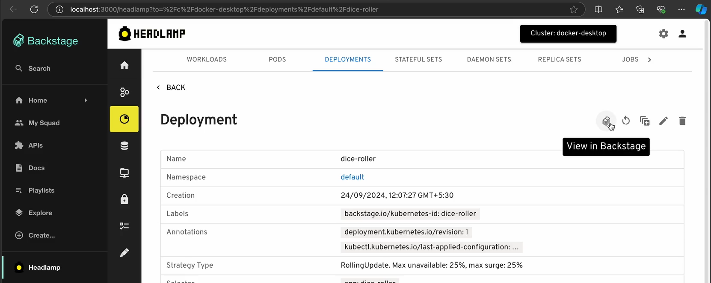

[Backstage](https://backstage.io/) is an open platform that streamlines developer workflows by offering a centralized hub for managing services, tools, and documentation, empowering teams to create their own developer portals for improved visibility and collaboration across projects. It enhances the developer experience by providing a single interface for accessing all tools and services, allowing organizations to easily catalog their services for better management, integrate various tools to streamline workflows, and standardize processes through templates, ultimately making development more efficient and less cumbersome.

<!--truncate-->

## Backstage and Kubernetes

Similar to Headlamp, Backstage has a plugin system to extend its functionality. The Backstage project has created plugins to integrate Kubernetes, allowing users to view resources and any errors. However, it does not provide a Kubernetes UI in the more traditional sense of it: a dedicated area for users to view any resources around the cluster, read logs, exec into containers, and more. As a Kubernetes UI, this is where Headlamp comes in.

### Enhancing Backstage for Kubernetes Management

At the last Kubecon in Paris we spoke with the Backstage team about how Headlamp and Backstage could work together. We quickly came to the conclusion that the projects complement each other and we should work on integrating them. Thus, we have created two plugins. One is a plugin for Backstage to embed Headlamp into the Backstage UI. The other is a plugin for Headlamp that links back to Backstage resources when Headlamp is running in a Backstage context. This allows for seamlessly moving between Headlamp and Backstage.

By integrating Headlamp with Backstage and vice versa, teams can leverage the strengths of both tools.

## Accessing Headlamp from Backstage

The Headlamp plugin for Backstage offers an embedded instance of Headlamp, enabling users to explore various Kubernetes components, including deployments, services, and configurations. It allows you to quickly execute common operations, such as viewing logs or checking the health of your resources. You can add a Headlamp entry to Backstage's sidebar as a convenient way to access it (see [these instructions](https://github.com/headlamp-k8s/backstage-plugin/tree/headlamp_plugin/headlamp#4-add-headlamp-to-the-sidebar)).

**Headlamp view in Backstage:**

Besides this access to the embedded view, users will now have direct links to the corresponding Headlamp views, when viewing services (running in Kubernetes) from the Backstage UI. From there, they can do the regular Kubernetes related operations (delete a pod, view logs, scale a deployment, ...), depending on their role access.

**The screenshot below shows a link from a resource in Backstage to Headlamp:**

### How to Install the Headlamp Plugin for Backstage

The Headlamp Plugin for Backstage is divided in a frontend plugin and a backend plugin. You can find the instructions for installing the backend plugin [here](https://github.com/headlamp-k8s/backstage-plugin/tree/headlamp_plugin/headlamp#configuration), and the frontend plugin [here](https://github.com/headlamp-k8s/backstage-plugin/tree/headlamp_plugin/headlamp#headlamp-plugin).

## Accessing Backstage from Headlamp

When in the embedded Headlamp instance, users will also find integrated links from various Headlamp views that allow them to jump to Backstages' own view for the related Kubernetes services. Thus, completing the circle and allowing cross-linking between both UIs.

**The screenshot below shows the button to access a Backstage view from Headlamp:**

But this is not limited to an embedded instance of Headlamp. This Backstage plugin for Headlamp has been developed so it can be deployed in any Headlamp flavor, allowing the user to configure the URL to their Backstage deployment making it useful even if we run Headlamp and Backstage separately.

**The screenshot below shows the settings of the Backstage plugin for Headlamp:**

### How to Install the Backstage plugin for Headlamp

The Backstage Plugin for Headlamp is already part of the Headlamp instance that is embedded in the plugin for Backstage. To install the plugin in a standalone Headlamp instance, either use the Plugin Catalog in the Headlamp desktop app, or follow a method similar to the one described in this [blog post](/blog/2022/10/20/best-practices-for-deploying-headlamp-with-plugins) if deploying Headlamp in the web or in-cluster.

## Demo

For better illustrating what Backstage + Headlamp can do together, here is a video demo by Santhosh Nagaraj from the Headlamp core team:

<iframe width="560" height="315" src="https://www.youtube.com/embed/xKwdjMRLShg?si=s5a9qqcnAtdSEpFX" title="YouTube video player" frameborder="0" allow="accelerometer; autoplay; clipboard-write; encrypted-media; gyroscope; picture-in-picture; web-share" referrerpolicy="strict-origin-when-cross-origin" allowfullscreen></iframe>

## Future

Backstage and Headlamp share a similar foundation, catering to distinct audiences: Backstage serves developers seeking a portal, while Headlamp targets Kubernetes users in need of a user interface. Both platforms leverage a robust plugin system, which enhances their functionality. We see these projects as complementary, providing valuable solutions for teams that require an internal portal and operate Kubernetes clusters. By integrating their capabilities through plugins, we aim to offer them a more comprehensive experience.

We believe that Headlamp serves as an excellent foundation for implementing UIs for any CNCF tool related to Kubernetes. Integrations like the Backstage plugin exemplify this potential. We provide similar plugins for CNCF projects like OpenCost, Flux, etc. with more in the pipeline. If you see an opportunity for a similar integration in your project and need assistance, please reach out to us on Slack. We look forward to building a robust collection of UIs for various Kubernetes tools!
