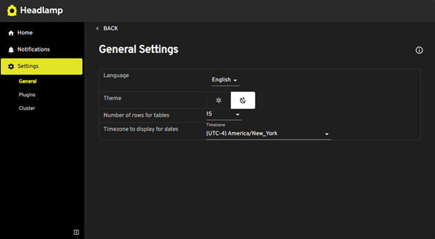
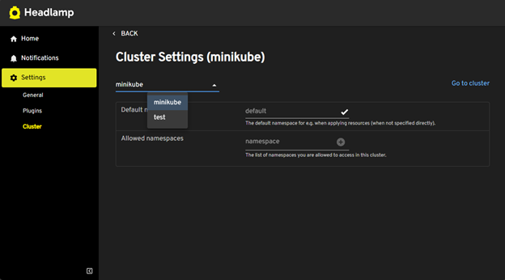

In the past, navigating settings in Headlamp was fairly confusing.  While both general app settings and cluster settings were accessible via the "Settings" button, the view accessed depended on whether the button was clicked from a cluster view or not. This separation made it difficult for users to find and manage settings, especially given Headlamp's wide range of use cases, whether deployed on the web, Docker Desktop, or other environments. Recognizing this challenge, we've refined and unified all settings — general, plugin, and cluster — into the sidebar, allowing users to configure Headlamp in one place.

<!-- truncate -->

## Accessing the settings

Previously, accessing settings from the sidebar in the home view would take you to the general settings, without the option to view or configure the settings for any clusters you had set up. Now, the settings experience has been improved and consolidated.
Simply click on the "Settings" button in the sidebar from the home view, and you'll be taken to the general settings, with easy access to plugin and cluster settings as well. If you're navigating from within a specific cluster, the "Settings" button now takes you directly to that cluster's settings, just like before. But of course, the general settings are still accessible from the sidebar.

You can also access the settings for any of the clusters you have set up, without having to navigate to them individually, since we've added a selector to choose the cluster for which to show the settings. There is also a link on the right side to quickly access that cluster.

## Conclusion

Headlamp strives to cover a wide range of use cases, from web deployments to Docker Desktop and more. Sometimes, this flexibility leads to parts of the UI that need refinement as new use cases emerge. By unifying the settings into one place, we've addressed a long-standing UX challenge, making Headlamp easier to navigate and configure. We're always looking to improve, so if you encounter any UX issues or have suggestions, we would love to hear from you (file an [issue](https://github.com/headlamp-k8s/headlamp/issues), or chat with us on [Slack](https://kubernetes.slack.com/messages/headlamp)). Until next time!
