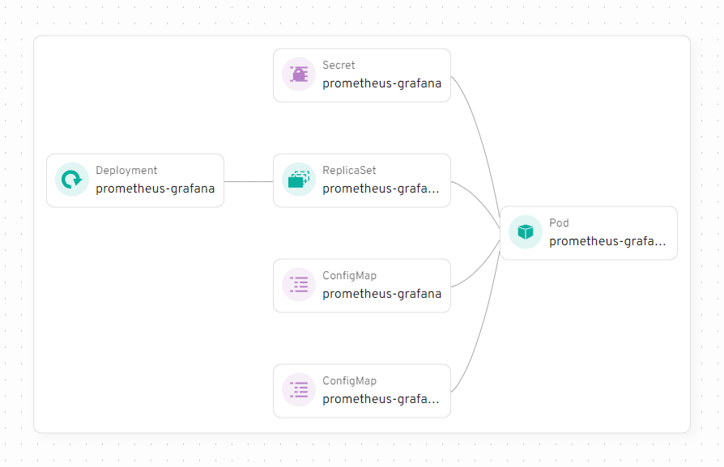
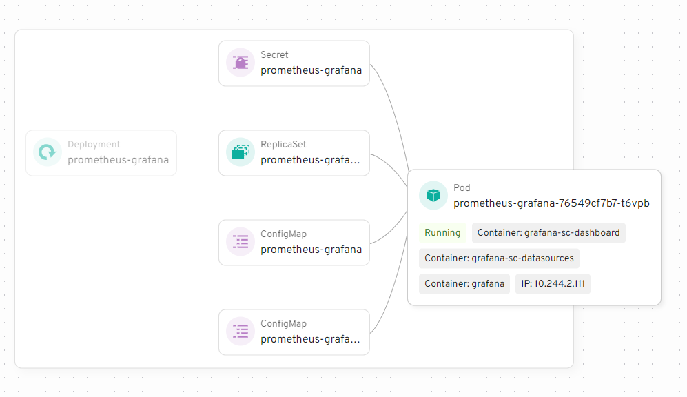
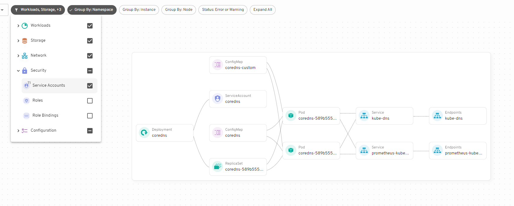
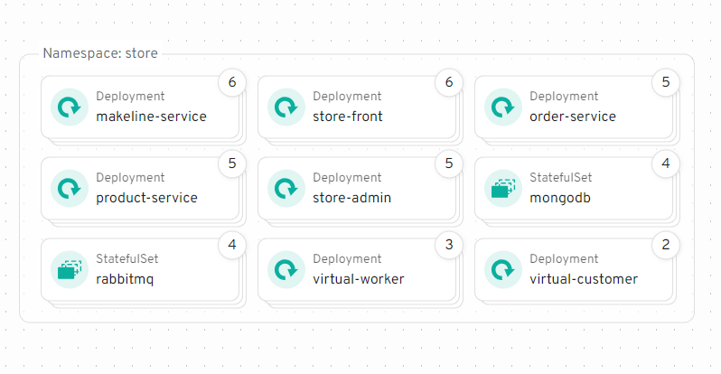

import mapDemo from "./map-demo.mp4";

In version 0.26, Headlamp introduced a new feature: the Map View. It provides a graphical way to see how components like pods, services, and deployments interact in your Kubernetes cluster. This makes it easier to understand dependencies, troubleshoot issues, and optimize your cluster setup.

<!--truncate-->

## About

  <video controls width="100%">
    <source src={mapDemo} type="video/mp4" />
  </video>

Instead of working with tables or YAML files, you can now visually explore the connections between resources. For example, you can see which pods are linked to which services or how deployments relate to replica sets. This makes it much simpler to understand your cluster’s structure.

When troubleshooting, the Map View is especially useful. If a pod fails, you can find which services or deployments depend on it, helping you identify the cause of the issue.

We’re also working on providing APIs for plugins, allowing you to extend the Map View with extra details.

The Map View is available now. [Try out Headlamp with Map view now.](/)

## Examples

<figure style={{ margin:"0 0 2rem 0" }}>

<figcaption>Prometheus Grafana Deployment</figcaption>

</figure>

<figure style={{ margin: "0 0 2rem 0" }}>

<figcaption>Hover over a resource to see more information.</figcaption>

</figure>

<figure style={{ margin: "0 0 2rem 0" }}>

<figcaption>Select which resources to display</figcaption>

</figure>

<figure style={{ margin: "0 0 2rem 0" }}>

<figcaption>View all resources in a namespace</figcaption>

</figure>
