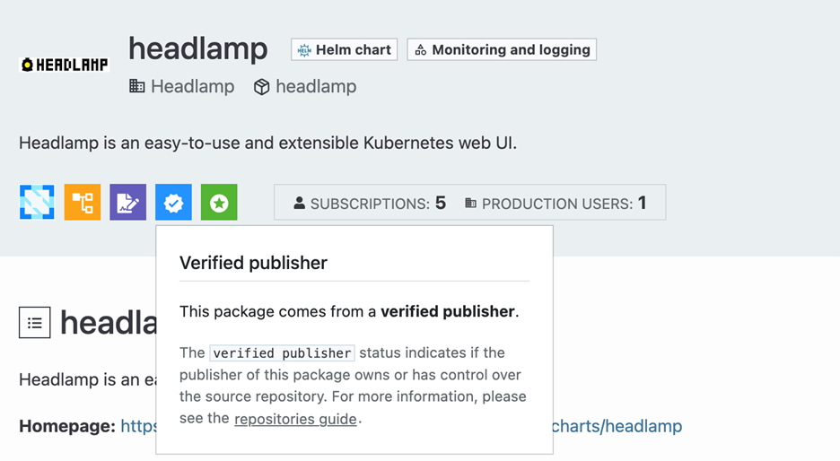

A crucial part of Headlamp's deployment process is its Helm chart, which simplifies the installation and configuration of Headlamp in Kubernetes environments. In the ever-evolving landscape of Kubernetes, security remains a top priority. Recognizing this, we have enhanced the security features of Headlamp's Helm chart.

<!-- truncate -->

In this post, we will explore the recent security improvements we have implemented, including the addition of a value schema, signing of Helm charts, and verified and official publisher status in [ArtifactHub](https://artifacthub.io/packages/helm/headlamp/headlamp). These enhancements not only increase the security of Headlamp deployments but also align with best practices in the Kubernetes ecosystem.

## Understanding the Current Security Landscape

Before diving into our specific enhancements, it is important to understand the broader security concerns in Kubernetes and how they relate to Helm charts.

Kubernetes environments face various security challenges, including:
* Unauthorized access to clusters and resources.
* Misconfigured RBAC policies.
* Exposed sensitive information in ConfigMaps or Secrets.
* Container vulnerabilities and outdated images.
* Network policy misconfigurations.

When it comes to Helm charts, additional security considerations come into play:
* Integrity of chart sources.
* Validation of chart values.
* Proper handling of sensitive data.
* Version control and update management.

These challenges highlight the necessity for strong security measures in Kubernetes setups, particularly when using Helm for application management.

## Key Security Enhancements

### Value Schema Addition

One of the significant improvements we have made is the addition of a value schema to Headlamp's Helm chart. This enhancement provides several benefits:
* Improved validation of user-supplied values.
* Clear documentation of available configuration options.
* Reduced risk of misconfigurations due to typos or incorrect value types.

Using a value schema has simplified user understanding and correct configuration of Headlamp, lowering the risk of security issues from misconfiguration.

### Signing of Helm Charts

To ensure the integrity and authenticity of Headlamp's Helm chart, we have implemented chart signing. This process involves:
* Cryptographically signing the chart package using **gpg** keys.
* Enabling verification of the chart's origin and integrity using gpg fingerprint.

The benefits of this enhancement include:
* Assurance that the chart has not been tampered with.
* Verification of the chart's source.

Compliance with security best practices for software distribution.

### Verified + Official Status on ArtifactHub

Headlamp has verified and official publisher status for its Helm chart on ArtifactHub, which adds an extra layer of trust for users. This status brings several advantages:
* Increased trust in the Headlamp chart.
* Easier discovery of Headlamp in Helm repositories.

## Implementation Guide

### Value Schema Addition in Headlamp's Helm Chart
1. **Schema Structure:** The _values.schema.json_ file uses JSON Schema syntax to define the structure of the values. It typically includes:
    * **$schema:** Specifies the JSON Schema version being used
    * **type:** Usually set to "object" for the root level
    * **properties:** Defines the individual configurable values
2. **Data Types:** Each property in the schema is assigned a specific data type, such as:
    * string
    * number
    * boolean
    * array
    * object
3. **Validation Rules:** The schema can include various validation rules, such as:
    * required: Specifies which properties are mandatory
    * minimum and maximum: For numeric values
    * minLength and maxLength: For string values
    * pattern: Regex patterns for string validation
    * enum: List of allowed values
4. **Default Values:** While default values are typically defined in _values.yaml_, the schema can include a default field for each property to document the default value.
5. **Descriptions:** Each property can include a description field, providing documentation directly in the schema.
6. **Nested Structures:** For complex configurations, the schema can define nested objects and arrays, mirroring the structure of the values.yaml file.

#### Integration with Helm

1. **Placement:** The _values.schema.json_ file is placed in the root directory of the Helm chart.
2. **Helm Validation:** Helm automatically uses this schema to validate values during helm install, helm upgrade, and helm template operations.
3. **CI/CD Integration:** The schema can be used in CI/CD pipelines to validate values before deployment.

#### Benefits in Practice

1. **Error Prevention:** Helm will throw an error if provided values do not conform to the schema, preventing misconfigurations from being applied to the cluster.
2. **IDE Support:** Many IDEs can use the schema to provide auto-completion and inline documentation when editing values.yaml files.
3. **Documentation:** The schema serves as a form of self-documentation, clearly defining what can be configured and how.
4. **Versioning:** As the Helm chart evolves, the schema can be versioned alongside it, clearly indicating changes in configuration options.

#### Challenges and Considerations

1. **Maintenance:** The schema needs to be kept in sync with the actual chart templates and default values.
2. **Complexity:** For charts with many configurable options, the schema can become quite large and complex.
3. **Backward Compatibility:** Changes to the schema need to be managed carefully to maintain backward compatibility or to clearly communicate breaking changes.

#### Example Structure

```json
{
  "$schema": "http://json-schema.org/draft-07/schema#",
  "type": "object",
  "properties": {
    "replicaCount": {
      "type": "integer",
      "description": "Number of replicas to deploy",
      "minimum": 1
    },
    "image": {
      "type": "object",
      "title": "Image",
      "description": "Image to deploy",
      "properties": {
        "registry": {
          "type": "string",
          "description": "Registry of the image"
        },
        "repository": {
          "type": "string",
          "description": "Repository of the image"
        },
        "pullPolicy": {
          "type": "string",
          "description": "Pull policy of the image",
          "enum": ["Always", "IfNotPresent", "Never"]
        },
        "tag": {
          "type": "string",
          "description": "Tag of the image"
        }
      }
    }
  }
}
```

### Signing of Helm charts using gpg keys

Signing Helm charts ensures the integrity and authenticity of the chart package. Headlamp uses GPG (GNU Privacy Guard) for signing, integrated into the GitHub Actions workflow for automated signing during the release process.

#### Key Components

* **GPG Key:** A GPG key pair (public and private) used for signing.
* **GitHub Secrets:** Storing sensitive information like GPG keys and passphrases.
* **chart-releaser-action:** A GitHub Action for releasing Helm charts.
* **Chart.yaml:** Helm chart metadata file, including signing information.

#### Key Components

1. GPG Key Preparation

The workflow prepares the GPG key for signing:

```yaml
- name: Prepare GPG key
  run: |
    gpg_dir=.cr-gpg
    mkdir "$gpg_dir"

    # referring keyring to private key of gpg
    keyring="$gpg_dir/secring.gpg"

    # storing base64 GPG key into keyring
    base64 -d <<< "$GPG_KEYRING_BASE64" > "$keyring"

    passphrase_file="$gpg_dir/passphrase"

    # storing passphrase data into a file
    echo "$GPG_PASSPHRASE" > "$passphrase_file"

    # saving passphrase into github-environment
    echo "CR_PASSPHRASE_FILE=$passphrase_file" >> "$GITHUB_ENV"

    # saving private key into github-environemnt
    echo "CR_KEYRING=$keyring" >> "$GITHUB_ENV"
  env:
    GPG_KEYRING_BASE64: "${{ secrets.GPG_KEYRING_BASE64 }}" #Referring secrets of github above
    GPG_PASSPHRASE: "${{ secrets.GPG_PASSPHRASE }}"
```

*Key points:*
* The GPG private key is stored as a base64-encoded secret in GitHub.
* The key is decoded and stored in a temporary file.
* The passphrase is stored in a separate file.
* Environment variables are set for the chart-releaser action.

2. Chart Signing with chart-releaser-action

The chart-releaser-action is used to sign and release the chart:

```yaml
- name: Run chart-releaser
  uses: helm/chart-releaser-action@a917fd15b20e8b64b94d9158ad54cd6345335584 # v1.6.0
  env:
    CR_TOKEN: "${{ github.token }}"
    CR_KEY: "${{ secrets.GPG_SIGNING_KEY_NAME }}" # Name used while creating key
    CR_SIGN: true # set to true to sign images
  with:
    config: .github/cr.yaml
    mark_as_latest: false # only headlamp is set to latest
```

**Key points:**
* **CR_SIGN:** true enables chart signing.
* **CR_KEY** specifies the name of the GPG key to use for signing.
* The action uses the prepared GPG key and passphrase for signing.

3. Chart.yaml Configuration

The _Chart.yaml_ file includes metadata about the signing key:

```yaml
annotations:
  artifacthub.io/signKey: |
    fingerprint: 2956B7F7167769370C93730C7264DA7B85D08A37
    url: https://keys.openpgp.org/vks/v1/by-fingerprint/2956B7F7167769370C93730C7264DA7B85D08A37

```

**Key points:**
* The fingerprint is the unique identifier of the GPG key used for signing.
* The URL points to a public key server where the public key can be retrieved.

#### Technical Details

* **GPG Key Generation:**
  * A GPG key pair is generated offline.
  * The public key is uploaded to a public key server (in this case, keys.openpgp.org).
  * The private key is base64 encoded and stored as a GitHub secret.

* **GitHub Secrets Configuration:**
  * GPG_KEYRING_BASE64: The base64-encoded private GPG key.
  * GPG_PASSPHRASE: The passphrase for the GPG key.
  * GPG_SIGNING_KEY_NAME: The name associated with the GPG key.

* **Workflow Execution:**
  * The workflow decodes the GPG key and sets up the environment.
  * chart-releaser-action uses this environment to sign the chart during the release process.

* **Signing Process:**
  * The chart package (.tgz file) is signed, creating a .prov file.
  * The .prov file contains a PGP signature that can be used to verify the chart's integrity.

* **Verification:**
  * Users can verify the chart using the public key available at the URL specified in Chart.yaml.
  * Verification can be done using helm verify command or by manually checking the PGP signature.

#### Security Considerations

1. **Key Management:** Secure storage and rotation of GPG keys are crucial.
2. **GitHub Secrets:** Access to GitHub secrets should be strictly controlled.
3. **Public Key Distribution:** Ensure the public key is readily available for users to verify charts.

#### Benefits

1. **Integrity:** Detects any tampering with the chart package.
2. **Authenticity:** Verifies that the chart comes from a trusted source.
3. **Trust:** Builds confidence in the Headlamp Helm chart among users.

By implementing this signing process, Headlamp ensures that its Helm charts are verifiably authentic and untampered, enhancing security and trust in the Kubernetes community.

### ArtifactHub Verified + Official Publisher Status



The Verified and Official Publisher status on ArtifactHub is a way to certify the authenticity and ownership of packages, including Helm charts. This status is represented by a blue badge on the ArtifactHub interface, indicating that the publisher has gone through a verification process.

#### Key Components
* **artifacthub-repo.yml:** This needs to have information about your
* **Chart.yaml** file with comprehensive metadata including maintainer information
* **Repository indexed:** To ensure optimal discoverability and integration, we implemented robust repository indexing practices.

#### Process Details

1. Metadata Configuration:

Create a _artifacthub-repo.yml_ file in your Helm chart repository. For example, the Headlamp repository yaml is located at the gh-pages branch.

```yaml
repositoryID: de353ebb-8d3f-4717-9813-b3ec4621a93b
owners:
- name: OWNER_NAME
  email: OWNER_EMAIL
```

2. Chart Metadata

Ensure that your _Chart.yaml_ file includes the accurate metadata.

```yaml
maintainers:
- name: <maintainer-name>
   email: <maintainer-email>
```

3. Repository Indexing

Ensure your Helm repository is properly indexed. You need to run command `helm repo index .` to properly index it.

#### Benefits of Verified + Official Publisher Status

* **Enhanced Visibility:** Verified and official Helm charts appear higher in search results.
* **User Trust:** The badge signals reliability and authenticity to users.
* **Community Standing:** Demonstrates commitment to quality in the Kubernetes ecosystem.
* **Security Assurance:** Implies regular security audits and best practices.

By maintaining Verified and Official Publisher status, Headlamp demonstrates its commitment to providing secure, reliable, and well-maintained Helm charts to the Kubernetes community.

### Impact and Benefits

These security enhancements significantly improve Headlamp's overall security posture:
* Reduced risk of misconfigurations and associated vulnerabilities.
* Increased confidence in the integrity of Headlamp deployments.
* Better alignment with industry security standards and best practices.
* From a user experience perspective, these improvements offer:
* Clearer configuration options and validation.
* Increased trust in Headlamp as a secure Kubernetes UI solution.

## Conclusion

In this post, we have explored the recent security enhancements to Headlamp's Helm chart, including the addition of a value schema, implementation of chart signing, and achievement of verified and official publisher status. These improvements demonstrate our commitment to providing a secure, reliable Kubernetes dashboard solution.

Looking ahead, we are continually evaluating and improving our security measures. Future enhancements may include:
* Enhanced RBAC configurations.
* Automated security scanning and reporting using plugin.

We encourage you to upgrade to the latest version of Headlamp's Helm chart to take advantage of these security enhancements. As always, we welcome your feedback and contributions to make Headlamp even better.
