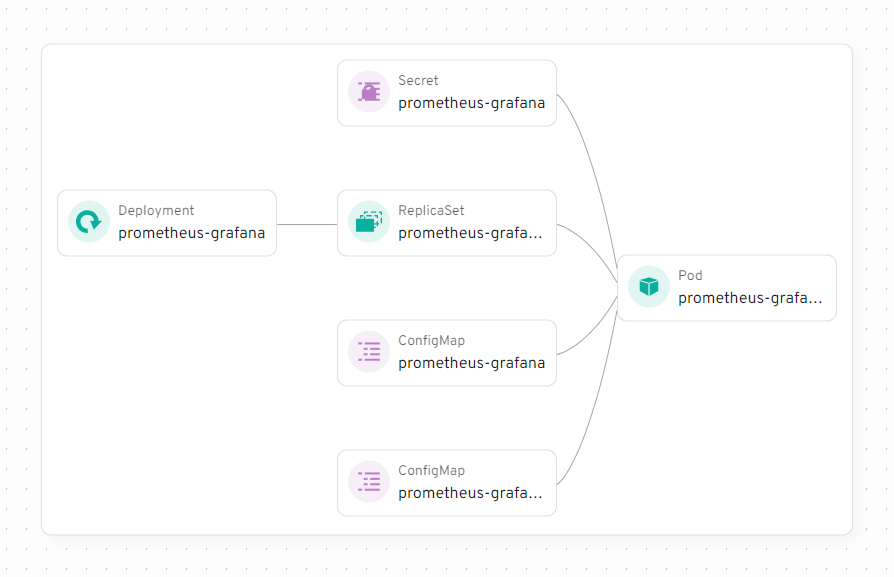
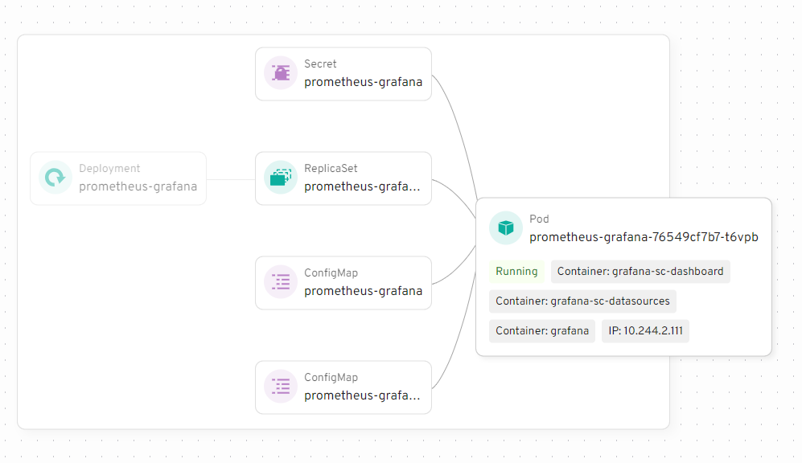
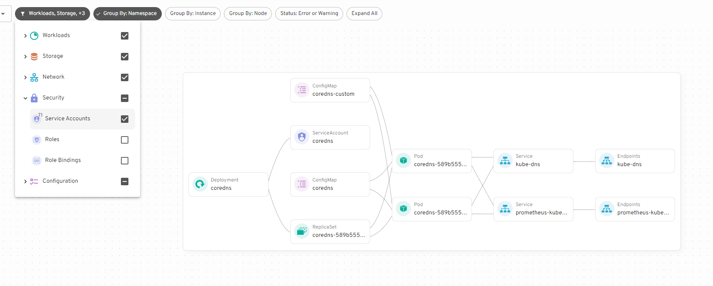
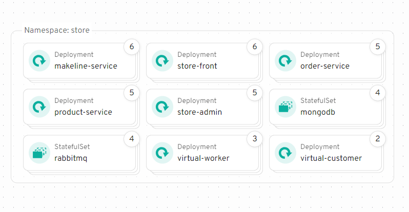

import mapDemo from "./map-demo.mp4";
import identifyProblems from "./identify-problems.mp4";

In version 0.26, Headlamp introduced a new feature: the Map View. A graphical way to see pods, services, and deployments interacting in Kubernetes clusters. Making it easier to understand dependencies, troubleshoot issues, and optimize Kubernetes clusters.

<!--truncate-->

## About

  <video controls width="100%">
    <source src={mapDemo} type="video/mp4" />
  </video>

Instead of working with tables or YAML files, you can now visually explore the connections between the Kubernetes resources. For example, you can see which pods are linked to which services or how deployments relate to replica sets. This makes it much simpler to understand your cluster’s structure.

When troubleshooting, the Map View is especially useful. If a pod fails, you can find which services or deployments depend on it, helping you identify the cause of the issue.

  <video controls width="100%">
    <source src={identifyProblems} type="video/mp4" />
  </video>

## Examples

In addition to the demo videos, here are some screenshots highlighting Map features.

<figure style={{ margin:"0 0 2rem 0" }}>

<figcaption>Prometheus Grafana Deployment</figcaption>

</figure>

<figure style={{ margin: "0 0 2rem 0" }}>

<figcaption>Hover over a resource to see more information.</figcaption>

</figure>

<figure style={{ margin: "0 0 2rem 0" }}>

<figcaption>Select which resources to display</figcaption>

</figure>

<figure style={{ margin: "0 0 2rem 0" }}>

<figcaption>View all resources in a namespace</figcaption>

</figure>

## Conclusion

The Map View offers an intuitive way to explore and manage Kubernetes clusters.
By visually representing components and their interactions, it simplifies troubleshooting and helps optimize your setup. Whether you're experienced or new to Kubernetes, it’s a helpful tool to better understand your cluster.
In the future we're planning on providing APIs for plugins, allowing you to extend the Map View with extra details. If you have ideas or suggestions of what you'd like to see added to the Map [open a feature request on GitHub](https://github.com/kubernetes-sigs/headlamp/issues/new/choose) or [message us on Slack](https://kubernetes.slack.com/messages/headlamp).
[Try out Headlamp with Map view now.](/docs/latest/installation/)
