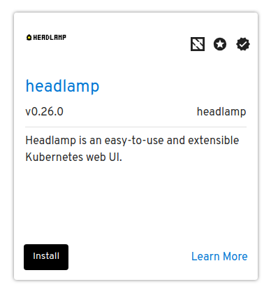
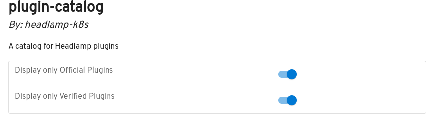
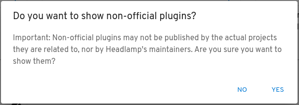

Headlamp provides support for Helm chart installation via the [App Catalog](https://github.com/headlamp-k8s/plugins/tree/main/app-catalog)
plugin, and allows to install Headlamp plugins via the [Plugins Catalog](https://github.com/headlamp-k8s/plugins/tree/main/plugin-catalog) (which
is also a plugin). Both the App Catalog and Plugin Catalog in Headlamp leverage
[ArtifactHub](https://artifacthub.io/) packages to provide users with trusted resources for Kubernetes
management and customization. The App Catalog enables users to find and deploy
Helm charts directly from Headlamp, while the Plugin Catalog allows users to
browse and install plugins by the Headlamp Community.

<!--truncate-->

Security is at the core of these features with both catalogs incorporating
ArtifactHub’s badging system, including verified, official, and CNCF project
designations. These visual indicators, combined with verified publisher
filtering, give users confidence in selecting high-quality and secure Helm
charts and Headlamp plugins.

## Badges

**Verified Badge:** This checkmark indicates that the repository publisher owns
or has control over the repository associated with this package (Helm chart or
Plugin).

**Official Badge:** Marked by a star, this badge signifies that the publisher owns
the _software_ or _project_ that the package primarily focuses on.

**CNCF Badge:** The Cloud Native Computing Foundation Badge, signifies that the
Helm chart or plugin is associated with a project under the CNCF.

Here is an example of a Helm chart displayed with all three badges in the App
Catalog:

## Other UI Changes

Additionally, with the introduction of these badges we provide users with the
option to filter results in both plugins via a switch. In the case of the App
Catalog the switch shows whether only verified plugins are shown, while in the
case of the Plugin Catalog there are two switches, for controlling showing not
only verified but also official plugins.

It is vital that users install only plugins they trust, so this switch is on by
default in both cases, meaning that only verified + official plugins or
plugins developed by Headlamp’s core developers are shown. While this limits
the results and options for the user, it also improves the confidence in the
results being shown, reducing the possibilities of installing undesired
packages. And of course, users can always choose to show everything by going to
the settings view of each plugin.

These switches are located in the settings view for each plugin. You can access
it by going to Settings > Plugins (in the home view) and then clicking the
respective plugin name. In the case of the Plugin Catalog, we have also added
the same switch to the actual catalog's page, since there are plugins that
cannot get the official badge (because they are done by a 3rd party, see for
example the KubeEscape plugin) but which users may still trust and wish to
install. To help users understand this decision, when the official switch is
turned off for the Plugin Catalog, a dialog is shown explaining that the users
should make sure they trust the plugins:

## Conclusion

These additions not only reduce risks but also speed up the selection process.
By putting key details front and center, these updates make navigation easier
and enhance security.

We’d love for you to explore these updates! If you have ideas for other small
changes that could improve clarity or security, we’re eager to hear your
feedback and contributions.