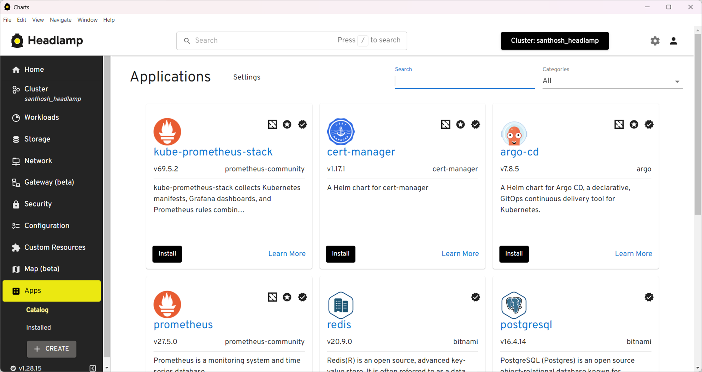
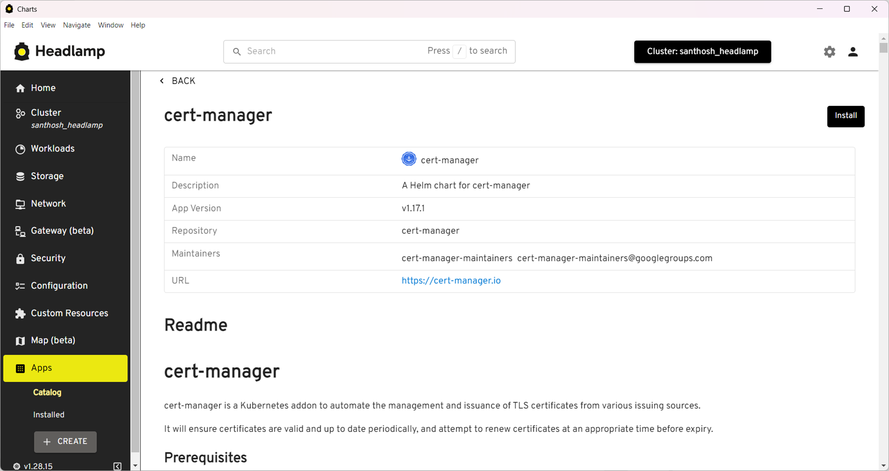
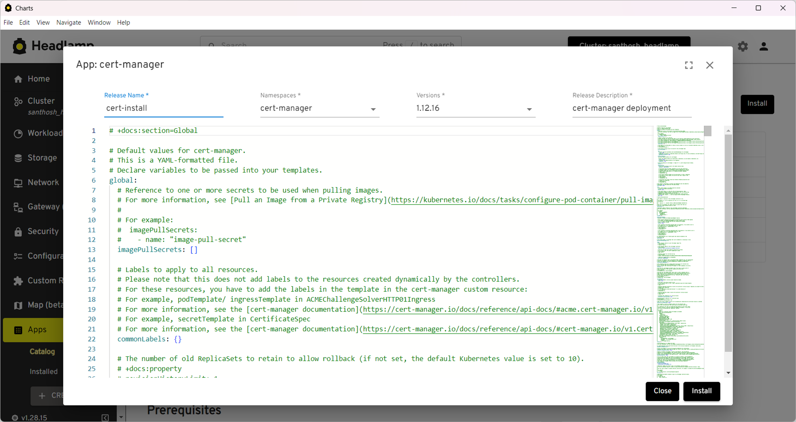
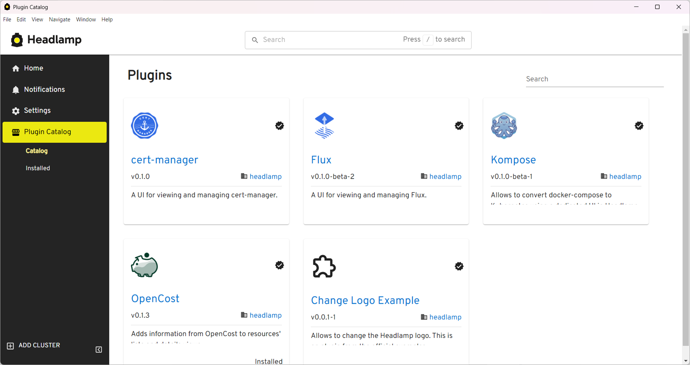
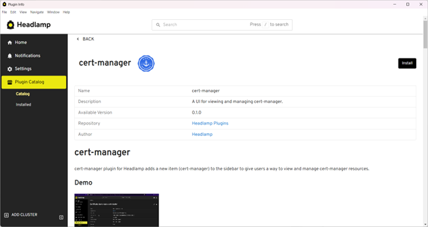
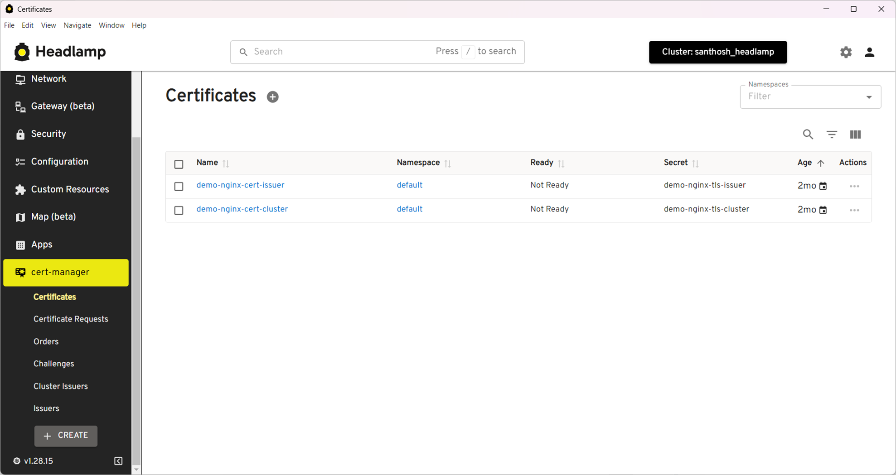
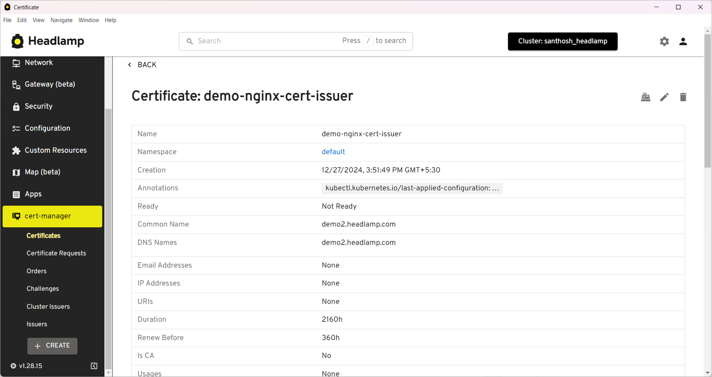

[cert-manager](https://cert-manager.io/) is a popular CNCF project that automates certificate management in Kubernetes environments, handling the issuance and renewal of TLS certificates. It supports various certificate sources including Let's Encrypt, HashiCorp Vault, and self-signed certificates, making it a crucial tool for managing secure communications in Kubernetes clusters. With cert-manager, teams can automate the complex process of certificate lifecycle management, reducing the risk of service disruptions due to expired certificates.

<!--truncate-->

To enhance the user experience of managing certificates in Kubernetes, we've developed a [Headlamp](https://headlamp.dev/) plugin for cert-manager. This plugin brings certificate management directly into Headlamp, allowing developers to view and manage cert-manager resources.

## Installing cert-manager in the cluster

If you don't have cert-manager installed in your cluster, you can install it in two ways:

### Using Headlamp's App Catalog

If you're using Headlamp as a desktop app, you can install cert-manager directly from the App Catalog:

1. Access the Apps section from the sidebar after connecting to your cluster.
2. Search for the cert-manager app.
3. Click Install.

<figure style={{ margin:"0 0 2rem 0" }}>

<figcaption>Apps Catalog</figcaption>
</figure>

<figure style={{ margin:"0 0 2rem 0" }}>

<figcaption>The cert-manager app in the Apps Catalog</figcaption>
</figure>

<figure style={{ margin:"0 0 2rem 0" }}>

<figcaption>Installing the cert-manager app in the Apps Catalog</figcaption>
</figure>


### Using Helm

Alternatively, you can install cert-manager using Helm by running these commands:

```bash
# Add the Jetstack Helm repository
helm repo add jetstack https://charts.jetstack.io

# Update your local Helm chart repository cache
helm repo update

## Install cert-manager with CRDs

helm install cert-manager jetstack/cert-manager \
--namespace cert-manager \
--create-namespace \
--set installCRDs=true
```

## Installing the cert-manager plugin

1. In Headlamp's home screen, click on Plugin Catalog > Catalog.
2. Find the cert-manager plugin and click Install.

<figure style={{ margin:"0 0 2rem 0" }}>

<figcaption>Plugin Catalog in Headlamp</figcaption>
</figure>

<figure style={{ margin:"0 0 2rem 0" }}>

<figcaption>cert-manager plugin in the Plugin Catalog</figcaption>
</figure>

## Plugin features

The cert-manager plugin allows users to list and view details of resources like Certificates, Certificate Requests, Issuers, ClusterIssuers, Orders, and Challenges. The resource details view also links to corresponding Kubernetes resources like Secrets and Ingresses, making it easy to navigate between related resources.

<figure style={{ margin:"0 0 2rem 0" }}>

<figcaption>Certificates list in the cert-manager plugin</figcaption>
</figure>

<figure style={{ margin:"0 0 2rem 0" }}>

<figcaption>A certificate shown in the cert-manager plugin</figcaption>
</figure>

## Looking Ahead

This is just the beginning! We’re continuously working on improving the cert-manager plugin based on user feedback. If you have suggestions or encounter any issues, please contribute via [GitHub](https://github.com/kubernetes-sigs/headlamp) or join our [Slack channel](https://slack.k8s.io/).

Try the cert-manager plugin for Headlamp today and simplify your Kubernetes certificate management! 🚀
