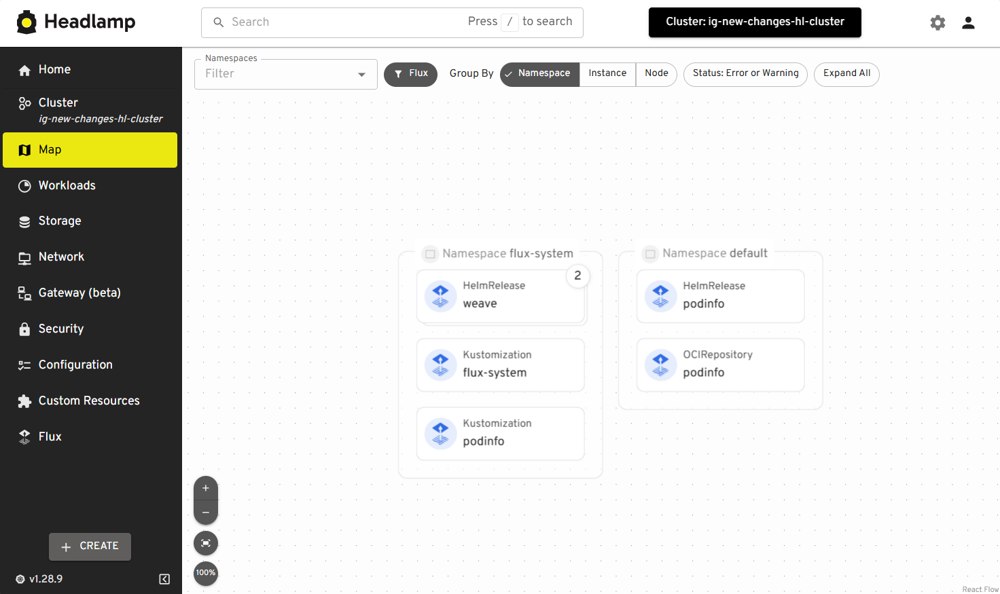

In November 2024, we [launched the Flux UI plugin for Headlamp](/blog/2024/11/07/flux-ui), bringing powerful
GitOps capabilities to Headlamp users, in an intuitive and visual way. Since then, we've received valuable feedback from the community, and we're excited to announce an updated version of the Flux plugin with several new features and improvements.

<!--truncate-->

## Overview page

A Flux user suggested we add an overview page for the Flux plugin, and we loved
the idea. This new page provides a comprehensive summary of your Flux resources,
including the version and checks related to Flux’s installation. Additionally,
it offers a graphical representation of the health of your deployments, making
it easier to manage and monitor them effectively.

<iframe width="560" height="315" src="https://www.youtube-nocookie.com/embed/ss77cuwrHQM?si=FTq-r23LzKgbGbQC" title="YouTube video player" frameborder="0" allow="accelerometer; autoplay; clipboard-write; encrypted-media; gyroscope; picture-in-picture; web-share" referrerpolicy="strict-origin-when-cross-origin" allowfullscreen></iframe>

## Flagger Integration

We're thrilled to introduce Flagger integration in this update. Flagger is a
progressive delivery tool that automates the release process for applications
running on Kubernetes. With this integration, the Flux UI now supports
visualizing different update strategies.

<iframe width="560" height="315" src="https://www.youtube-nocookie.com/embed/HSWOZexhfDc?si=qSpTGDD9PKEnn_ZI" title="YouTube video player" frameborder="0" allow="accelerometer; autoplay; clipboard-write; encrypted-media; gyroscope; picture-in-picture; web-share" referrerpolicy="strict-origin-when-cross-origin" allowfullscreen></iframe>

## New Map View for Flux

Another exciting addition is the new map view for Flux! We've had a map view in
Headlamp for a couple of versions now, and it’s proven to be an excellent way
to  quickly understand the cluster and its resources' relationships. This
feature offers a visual representation of your Flux resources and how they
relate to each other, providing a clearer understanding of your deployment
architecture.

## Bug Fixes and Community Contributions

This update also includes several bug fixes and improvements, thanks to the
contributions from our amazing community members: Stefan Prodan, Kingdon
Barrett, Matthijs Galesloot, and George Gaal. We appreciate your guidance,
support, and dedication to making the Flux UI better.

## Try this update

To try these new changes, just install or update the Flux UI plugin from the
Plugin Catalog, if using the desktop version of Headlamp, or update to the latest
[container image](https://github.com/headlamp-k8s/plugins/pkgs/container/headlamp-plugin-flux)
if you are deploying on the web.

We hope you enjoy this update!