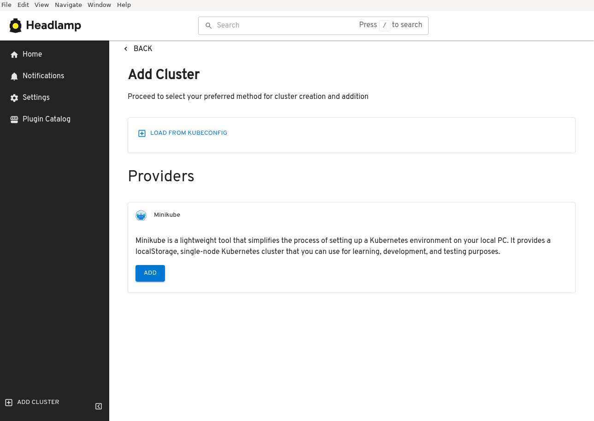
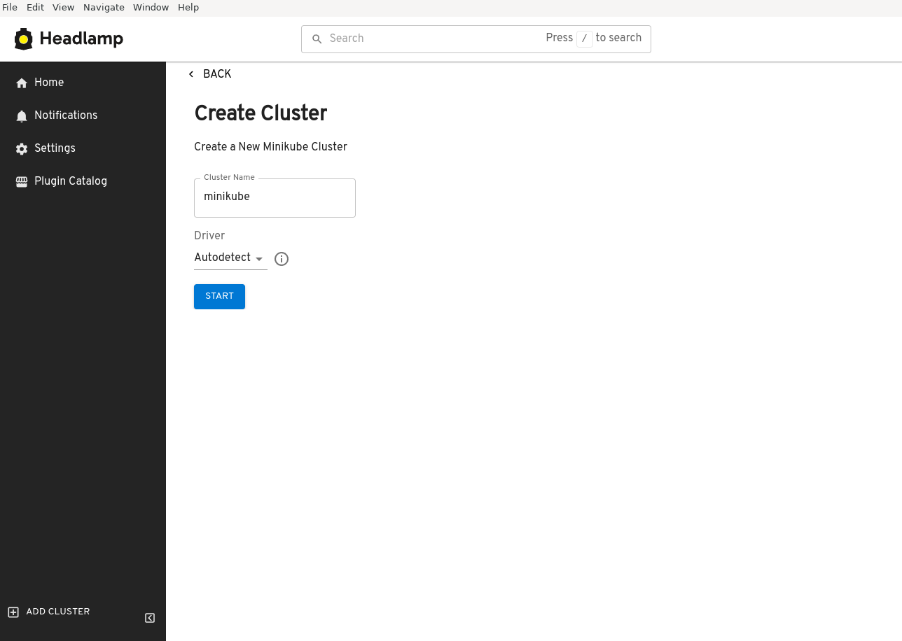
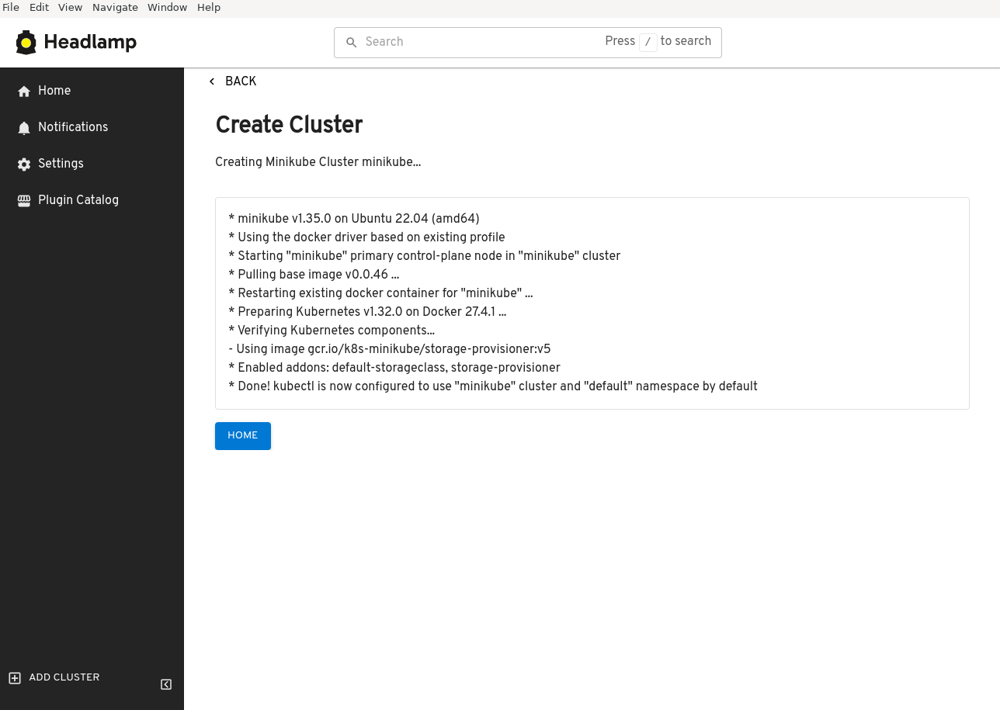
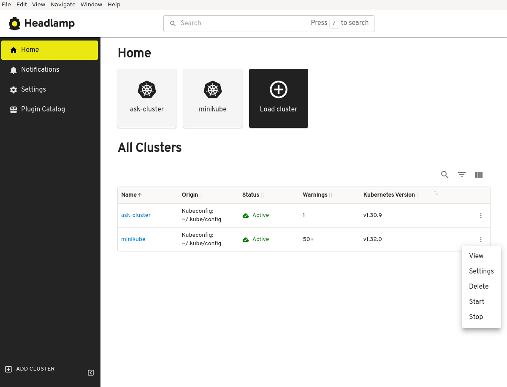

Kubernetes is typically run in the cloud, providing robust orchestration for
containerized applications. However, for novice Kubernetes users and those
looking to experiment locally, projects like
[minikube](https://minikube.sigs.k8s.io/) are essential. minikube
allows you to run Kubernetes on your local machine, making it easier to learn
and develop without needing a cloud environment.

<!--truncate-->

## How one gets started with Kubernetes

For new users, the learning curve for getting started with Kubernetes can be
steep. One first needs to understand different tools such as minikube, kubectl,
and hypervisors; all together making it a bit overwhelming. In addition,
setting up a local Kubernetes environment often requires familiarity with
command-line operations, which can be a barrier for those just starting out.
How can we improve that?

## Headlamp Desktop: A new starting point for Kubernetes

[Headlamp](https://headlamp.dev), aims to simplify the user experience around
Kubernetes. To take this to the logical next step,  we've created a plugin that
allows users to create a local Kubernetes environment using minikube with just
one click. This plugin eliminates the need for command-line operations, making
it accessible for everyone, regardless of their technical background.
In addition, it welcomes users into a visual, interactive Kubernetes
environment which they can explore. And using Headlamp's growing number of
plugins for CNCF and other projects in the eco-system, users can learn more
about the broader Kubernetes ecosystem.

<figure style={{ margin:"0 0 2rem 0" }}>

<figcaption>With the minikube plugin, users can now choose to add a minikube cluster instead of having to load it from a kueconfig file</figcaption>
</figure>

<figure style={{ margin:"0 0 2rem 0" }}>

<figcaption>There are a few options users can choose related to how the minikube cluster is created</figcaption>
</figure>

<figure style={{ margin:"0 0 2rem 0" }}>

<figcaption>While minikube is being created, this view gives information on the progress</figcaption>
</figure>

## Managing the environment

The minikube plugin not only installs and starts minikube but also provides
additional functionalities. Users can see the status of their minikube cluster
directly in the UI and have the ability to start or stop the cluster with ease.
This integration ensures that managing your local Kubernetes environment is
straightforward and intuitive.

<figure style={{ margin:"0 0 2rem 0" }}>

<figcaption>The minikube cluster context menu now shows start/stop options</figcaption>
</figure>

## Continuing to Improve the UX

We are committed to improving the user experience around CNCF projects and
lowering the bar for learning Kubernetes. While the minikube plugin is at an early
stage, we invite you to install it from the Plugin Catalog in Headlamp Desktop
and try it.
If you are interested in developing Headlamp plugins for other projects, check out
the [docs](http://localhost:3000/docs/latest/development/plugins/) and [reach out to us](https://headlamp.dev/docs/latest/faq#how-can-i-get-help-or-assistance-for-headlamp). Your feedback and contributions are
invaluable as we strive to make Kubernetes more accessible to everyone.

Thank you for your support, and happy Kubernetes-ing!
