KEDA (Kubernetes Event-Driven Autoscaling) allows users to scale Kubernetes
workloads based on external event sources like message queues, custom metrics,
or HTTP requests. While KEDA is widely used for autoscaling based on real-world
signals, working with KEDA resources like ScaledObjects and ScaledJobs often means
relying on kubectl and editing YAML by hand.

<!--truncate-->

As part of a Linux Foundation (LFX) Mentorship project, we have built a Headlamp
plugin that integrates a UI for viewing and managing KEDA resources directly in
the Headlamp dashboard. The plugin was developed by [Adwait Godbole](https://github.com/adwait-godbole),
with guidance from the Headlamp team.

## Installing KEDA in your cluster

Before using the plugin, make sure KEDA is installed. You can choose one of these methods:
1. Using Headlamp’s App Catalog:
  If you’re using Headlamp as a desktop app, you can install KEDA directly from the App Catalog:
    1. Open the Apps Section from the sidebar
    2. Search for KEDA.
<figure style={{ margin:"0 0 2rem 0" }}>
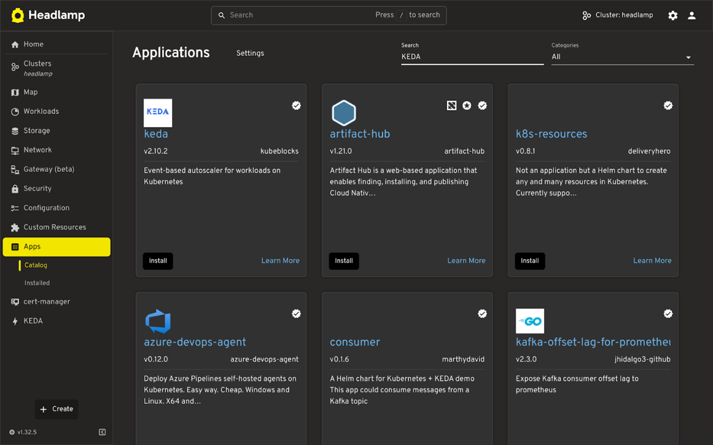
<figcaption>Apps catalog showing the KEDA search results</figcaption>
</figure>

    3. Click on KEDA app
      <figure style={{ margin:"0 0 2rem 0" }}>
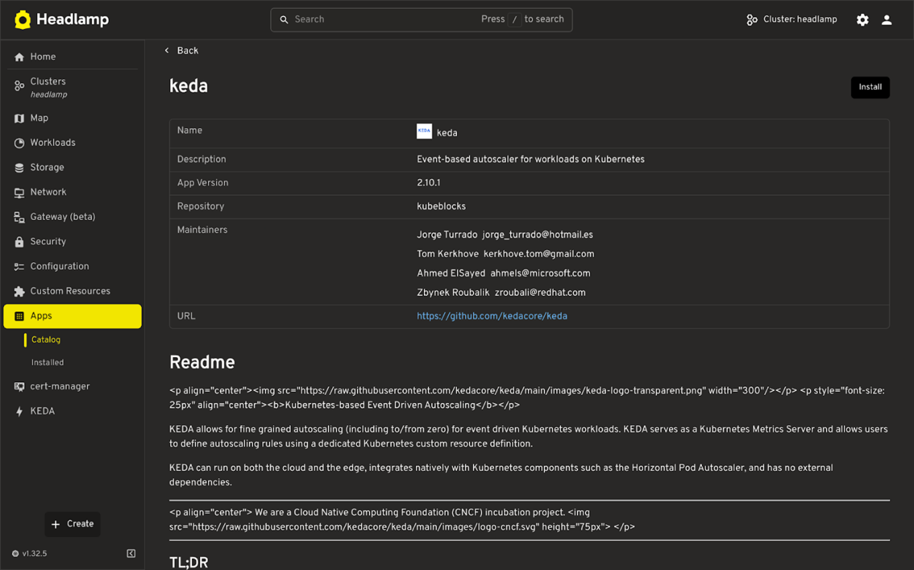
<figcaption>KEDA app details in the App Catalog</figcaption>
</figure>
    4. Fill in the required details like **name**, **namespace**, and **version**.

:::note
To see real-time metrics for KEDA triggers in the plugin, you’ll need to configure KEDA to expose metrics to the Prometheus Operator.
:::

      In the YAML editor (which shows the Helm _values.yaml_), configure the following under _prometheus.operator.serviceMonitor_:

        ```yaml
        prometheus:
          operator:
            serviceMonitor:
            enabled: true
            interval: "10s"
            additionalLabels:
                release: prometheus
        ```

      <figure style={{ margin:"0 0 2rem 0" }}>
        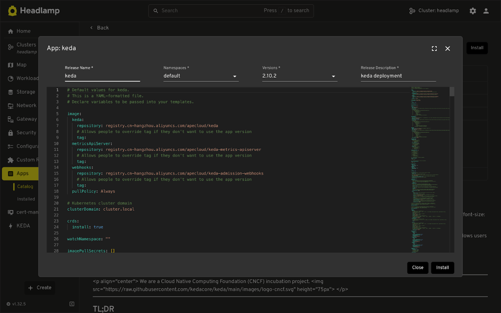
      <figcaption>YAML editor for KEDA Helm values</figcaption>
      </figure>

    5. Click **Install** to finish.

  2. Using Helm directly, run the following command:
    ```bash
    helm repo add kedacore https://kedacore.github.io/charts
    helm repo update
    helm install keda kedacore/keda \
      --namespace keda \
      --create-namespace \
      --set prometheus.operator.enabled=true \
      --set prometheus.operator.serviceMonitor.enabled=true \
      --set prometheus.operator.serviceMonitor.interval="10s" \
      --set prometheus.operator.serviceMonitor.additionalLabels.release="prometheus"
    ```

## Installing the KEDA Plugin in Headlamp

Once KEDA is installed in your cluster:

1. Go to Plugin Catalog → Catalog in the Headlamp home view sidebar.
2. Search for the KEDA plugin and click Install.
  <figure style={{ margin:"0 0 2rem 0" }}>
    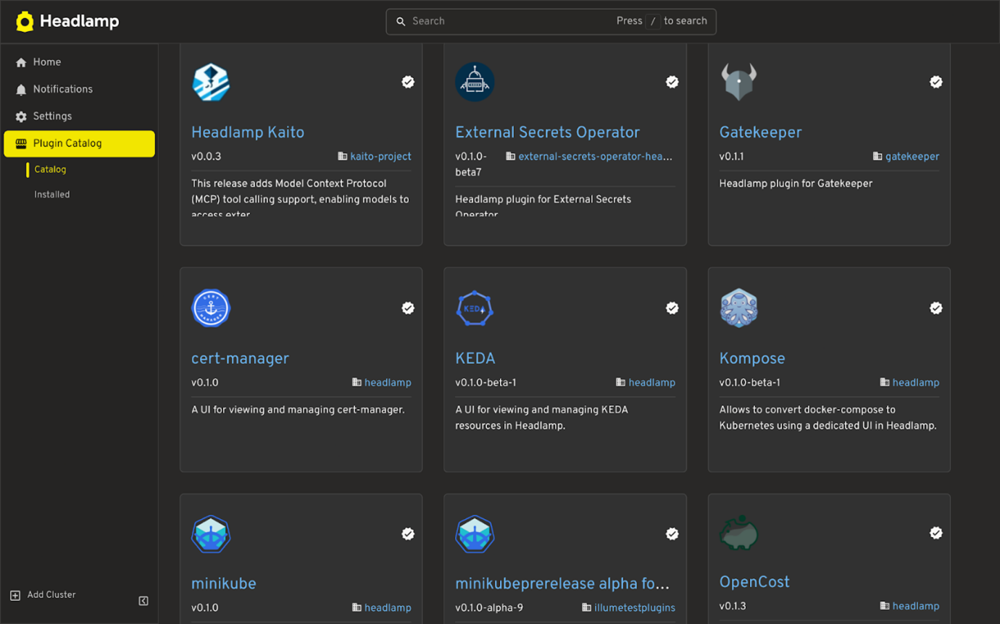
    <figcaption>Plugin Catalog showing the KEDA plugin</figcaption>
  </figure>
  <figure style={{ margin:"0 0 2rem 0" }}>
    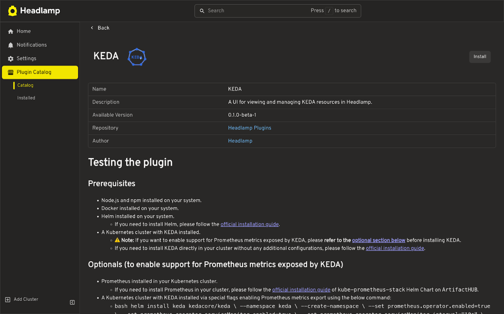
    <figcaption>KEDA plugin in the catalog</figcaption>
  </figure>

  Once the plugin is installed, navigate to the Cluster where you have installed KEDA. You’ll see a new KEDA section in the sidebar, where you can view and manage your KEDA resources.

## Plugin features

### List view of KEDA resources

* List all KEDA resource types
  * ScaledObjects
  * ScaledJobs
  * TriggerAuthentication
  * ClusterTriggerAuthentication
* Supports filtering and sorting
* Works across namespaces.

<figure style={{ margin:"0 0 2rem 0" }}>
  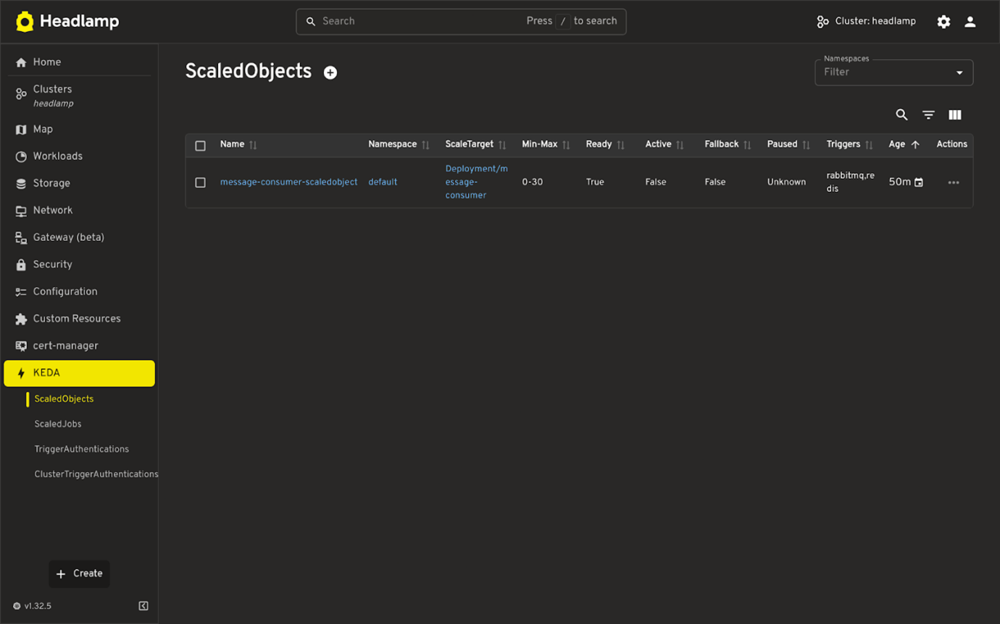
  <figcaption>List of KEDA ScaledObjects</figcaption>
</figure>
<figure style={{ margin:"0 0 2rem 0" }}>
  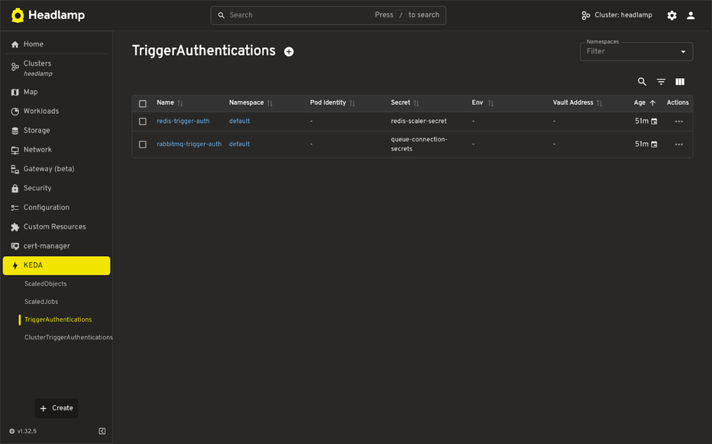
  <figcaption>KEDA trigger automations and metrics</figcaption>
</figure>

### Details View + YAML Editing

* Shows resource configuration, status, and metadata.
* Linked references (like target workloads or secrets) are shown where applicable.
Inline YAML editor for quick updates.

<figure style={{ margin:"0 0 2rem 0" }}>
  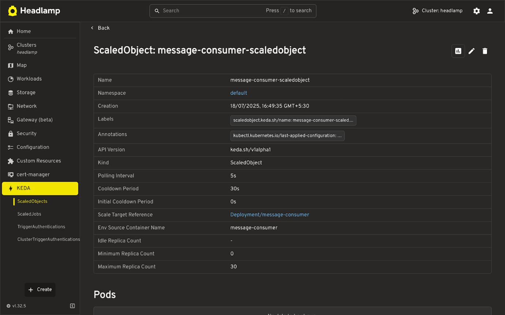
  <figcaption>Single KEDA ScaledObject details</figcaption>
</figure>

### Trigger Metrics (Real-Time)
* Displays live values from KEDA triggers (e.g. queue length, HTTP request rate).
* Shows current and max replica counts.
* Helps understand if scaling is working as expected.

<figure style={{ margin:"0 0 2rem 0" }}>
  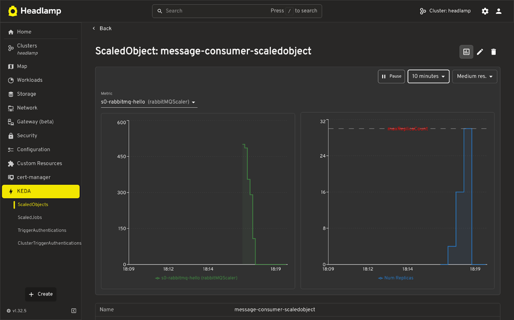
  <figcaption>KEDA ScaledObject chart and real-time metrics</figcaption>
</figure>


### Map View
* Visual representation of how KEDA resources relate to each other and to Kubernetes workloads.
* Helps understand the connection between ScaledObjects, triggers, and their targets.

<figure style={{ margin:"0 0 2rem 0" }}>
  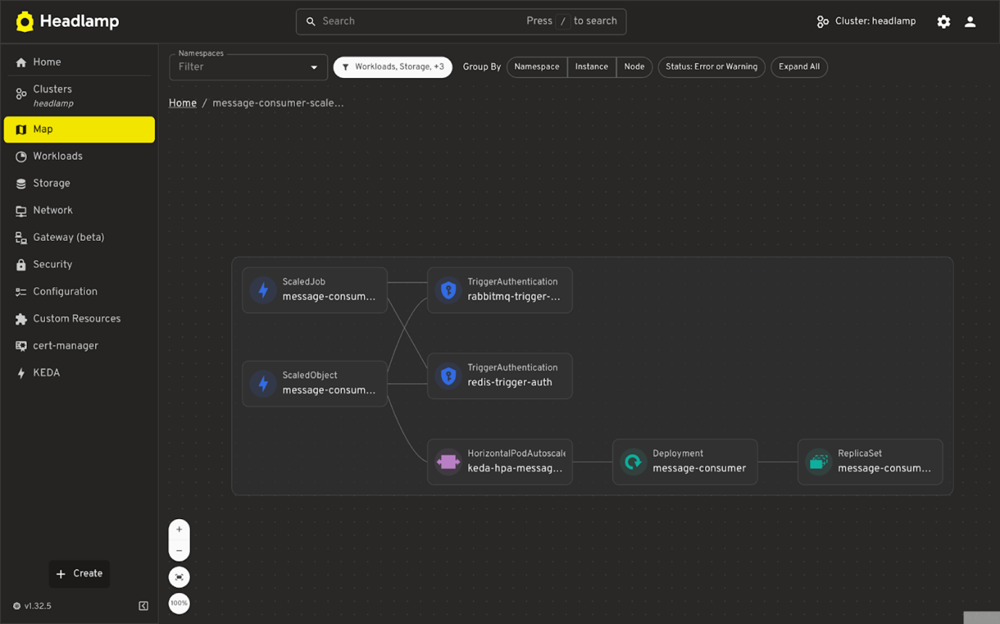
  <figcaption>KEDA resource map view</figcaption>
</figure>
<figure style={{ margin:"0 0 2rem 0" }}>
  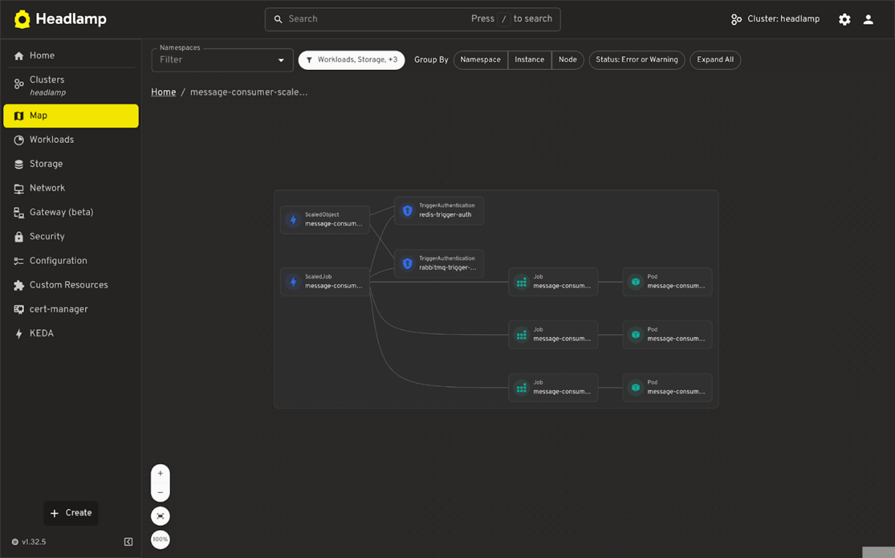
  <figcaption>Another view of KEDA resource relationships</figcaption>
</figure>

## Conclusion

The KEDA plugin for Headlamp makes it easier to work with event-driven autoscaling by providing a visual and navigable view of KEDA resources like ScaledObjects, ScaledJobs, and trigger authentications. With support for real-time metrics, cross-linked resources, and a built-in map view, you can now understand scaling behavior and troubleshoot issues without switching between tools like Prometheus dashboards or the CLI.

Everything you need to inspect, edit, and monitor KEDA resources is thus available in one place.

If you use KEDA, we encourage you to try the plugin and share feedback or ideas via [GitHub](https://github.com/headlamp-k8s/plugins).

