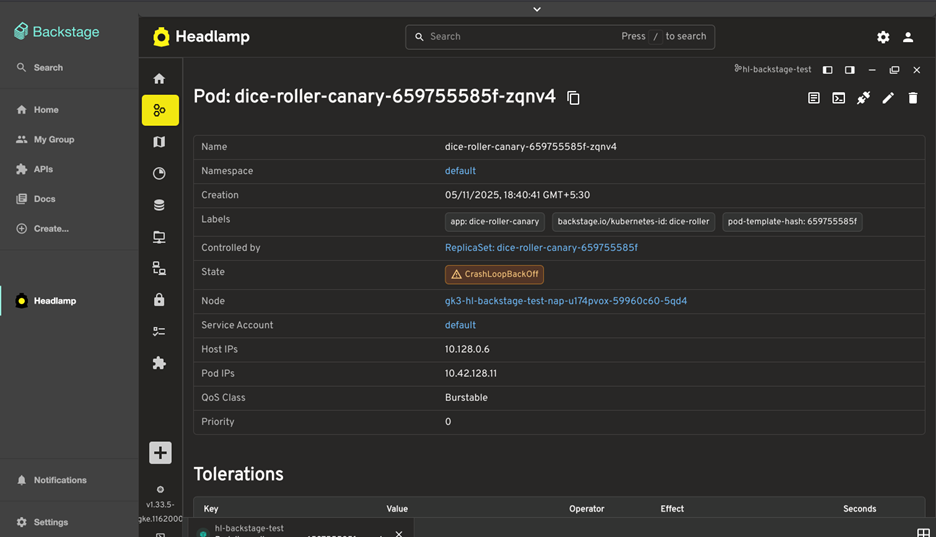

When we first introduced the [Backstage + Headlamp integration](https://headlamp.dev/blog/2024/11/11/introducing-an-integrated-backstage-and-headlamp-experience/), the goal was to give developers and platform engineers a unified way to view, debug, and manage Kubernetes resources directly from Backstage, without context-switching.
Following the release, several teams started using that integration in real multi-user environments and shared valuable feedback. This update focuses on addressing those suggestions and making the integration more robust.

<!--truncate-->

## Fixing multi-user authentication issues

In the initial implementation, the Headlamp instance relied on **kubeconfigs managed in the Headlamp backend**.
While this worked for single-user or demo setups, users noticed problems when multiple people accessed Headlamp simultaneously. Since the kubeconfig file was shared at the backend, **access levels got mixed up**, for example, one user's kubeconfig could overwrite another's, leading to mismatched permissions and resource visibility.

We've solved this by moving kubeconfig handling **to the user's browser**.
Now, each user session maintains its own cluster access through Headlamp's **stateless/dynamic clusters feature**. This ensures that:

- Each user's access level correctly reflects their own permissions.
- No kubeconfig is stored or shared on the server side.
- Backend state remains isolated and clean.

This change makes the integration much safer and closer to how Headlamp typically operates in standalone mode.

## Integrating with Backstage authentication

Another pain point users raised was that **Headlamp, when spawned as a process, didn't have its own authentication layer**, meaning it relied entirely on Backstage's session context, but without verification, which required administrators to take extra measures to secure the deployment.

To fix this, we introduced a **proxy layer inside the headlamp-backend plugin**.
Here's how it works:

- Backstage continues to handle user authentication as usual.
- The headlamp-backend plugin now exposes a **proxy endpoint** that forwards requests to the Headlamp server.
- Every request passing through this proxy goes through a **middleware check** that verifies authentication at the Backstage level.
- If the user is not authenticated in Backstage, the request to Headlamp is rejected.

Because all traffic now goes through this proxy, **the Headlamp server no longer needs to be exposed externally**. It can safely run as an internal process, completely hidden from direct access.
This design ensures that **Headlamp inherits Backstage’s authentication and access control model**, without needing to run a separate auth service or duplicate logic.
With these two main changes:
- Per\-user kubeconfig handling \(via browser sessions\)
- Auth\-aware proxy middleware between Backstage and Headlamp
The integration is now **stateless**, **multi-user safe**, and **aligned with Backstage's security model**.

From a developer's perspective, this also simplifies the deployment. You no longer need to manage shared kubeconfig files or expose the Headlamp server to the outside world. Everything runs behind Backstage's existing authentication and networking layer.

*Headlamp's map view provides a visual representation of Kubernetes resources and their relationships directly within Backstage*

*Detailed pod inspection within Backstage, powered by Headlamp's user-specific authentication*

## Try it!

These updates make the Backstage Headlamp integration more secure, predictable, and production-ready for multi-user setups.

We appreciate the community feedback that helped identify these issues and guide the improvements. If you are not yet using Headlamp on Backstage, this update should make your setup simpler and safer, so we encourage you to check the instructions and try it out.

**Instructions:**
* [For the frontend plugin](https://github.com/headlamp-k8s/backstage-plugin/tree/main/headlamp#configuration)
* [For the backend plugin](https://github.com/headlamp-k8s/backstage-plugin/tree/main/headlamp-backend#configuration)
