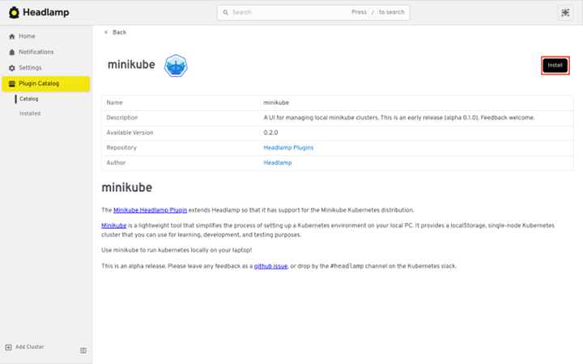
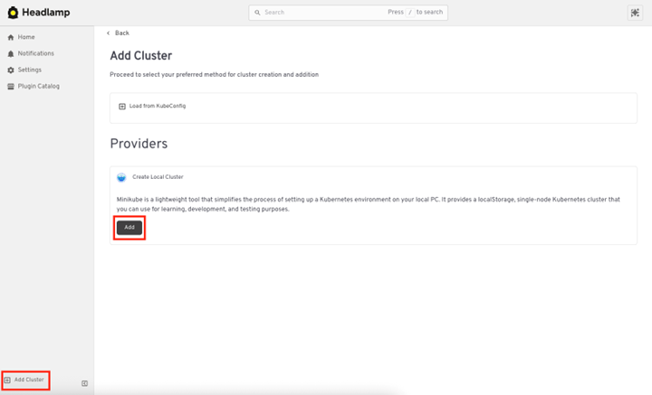
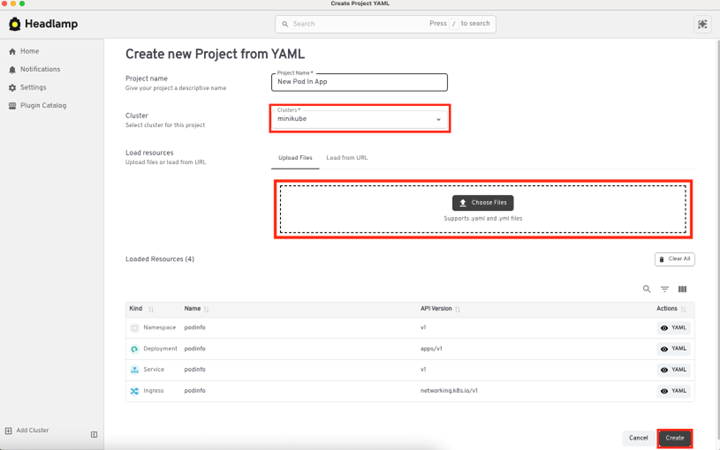
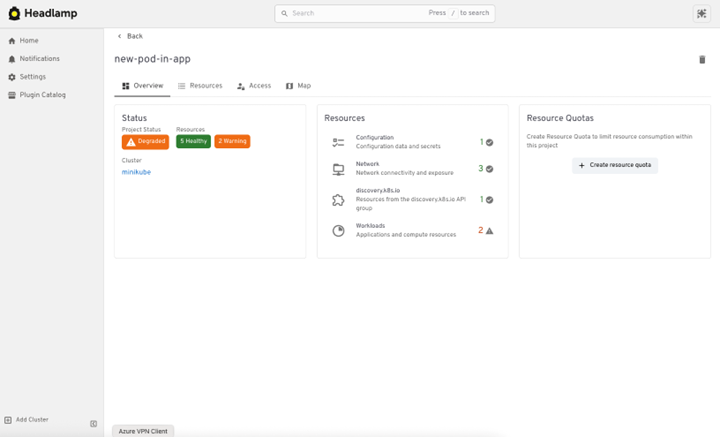
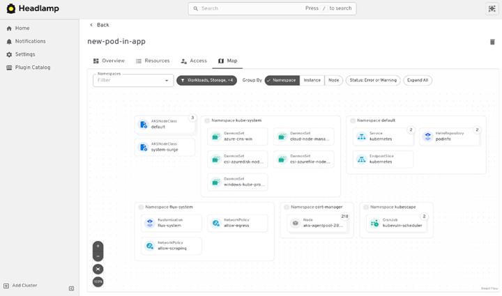
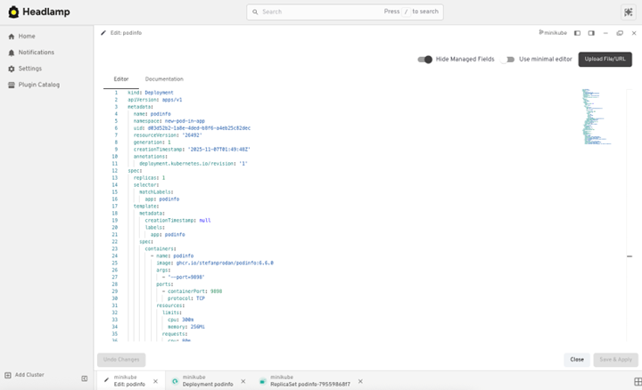
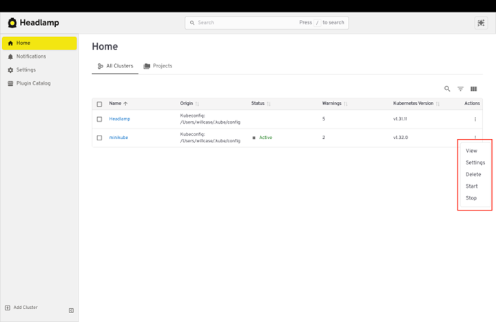

## The Problem

Starting with Kubernetes often means juggling cloud accounts, billing concerns, drivers, kubeconfig conflicts, and long waits just to see a pod run. You bounce between terminal commands, YAML files, and cluster views while trying to learn the basics or test a simple change. This is also the case when you are running Kubernetes locally. You have tons of choices, but you have to fiddle with the command line to get started.

<!--truncate-->

## The Solution

Headlamp removes that friction with **Local Cluster**. You can create and manage a fully functional Kubernetes cluster right from the Headlamp UI. No terminal. No cloud provider. Click to start, experiment safely, and get feedback fast in a graphical and intuitive way.

This approach is great for:
- Developers testing apps before production
- Students and learners trying Kubernetes for the first time
- Anyone who wants a safe sandbox without extra setup or cost

## What You Get

When you create a local cluster in Headlamp, you are spinning up a real Kubernetes cluster on your local machine using Minikube.

Your local cluster is:

- **Plain Minikube**: No cloud infrastructure needed
- **Integrated with Headlamp**: Managed entirely through the UI
- **Ideal for testing and learning**: Manage and troubleshoot applications with Projects, inspect resources, and explore features without setup headaches

Once created, the cluster appears in Headlamp like any other cluster. You can start and stop it, deploy applications, using Projects, and manage workloads in an application-centric view. Projects group related app resources into a single scoped space, making it easier to troubleshoot, monitor, and collaborate without navigating cluster-wide complexity.

## Deploy Your App Locally

Local Cluster gives you a fast inner loop. You try a change, see results, and iterate without waiting on remote environments or wrestling with credentials. Developers can validate workloads before pushing to shared clusters, and learners explore Kubernetes without cloud accounts or command line hurdles. When paired with **Projects**, this workflow scales beyond experimentation. Projects organize resources into an application-centric view, making collaboration and troubleshooting easier as your local work grows into real applications. Together, they turn Kubernetes from a setup challenge into a streamlined development experience.

## Step 1: Install the Minikube Plugin

<figure style={{ margin:"0 0 2rem 0" }}>

<figcaption>Install Minikube with one click from the Plugin Catalog.</figcaption>
</figure>

## Step 2: Create Cluster

<figure style={{ margin:"0 0 2rem 0" }}>

<figcaption>Setting up clusters and credentials slows learning and blocks quick experiments. Local Cluster starts a real Kubernetes environment on your local machine from the Headlamp UI so you can begin in minutes with zero cloud setup.</figcaption>
</figure>

## Step 3: Deploy directly into a project!

<figure style={{ margin:"0 0 2rem 0" }}>

<figcaption>Apply manifests from Headlamp and immediately see the results in the Project view so the feedback loop stays fast and focused.</figcaption>
</figure>

## Step 4: Observe only what matters to the app!

<figure style={{ margin:"0 0 2rem 0" }}>

<figcaption>Hunting through cluster wide logs and events wastes time. Headlamp scopes logs, events, status, and basic metrics to the Project so signals are relevant, and noise is reduced.</figcaption>
</figure>

## Step 5: See relationships with the map!

<figure style={{ margin:"0 0 2rem 0" }}>

<figcaption>Lists hide dependencies and flows. The map shows how services, pods, and configurations connect within the Project, so you spot missing pieces and broken paths quickly.</figcaption>
</figure>

## Step 6: Edit and iterate safely

<figure style={{ margin:"0 0 2rem 0" }}>

<figcaption>The built in editor adds structure and validation so changes are clearer and safer, which shortens the time from idea to working app.</figcaption>
</figure>

## Step 7: Control resources and lifecycle

<figure style={{ margin:"0 0 2rem 0" }}>

<figcaption>Local development can stress a laptop. Start, stop, and delete clusters from the UI so you keep resources under control while preserving work between sessions.</figcaption>
</figure>

## Keep Building

The best way to learn Kubernetes is by doing. Headlamp gives you a safe, fast environment to experiment and grow your skills. Check out the full setup guide for Local Cluster and [Projects](https://headlamp.dev/docs/latest/learn/projects/) in the Headlamp Learn docs. Start today and keep building.
