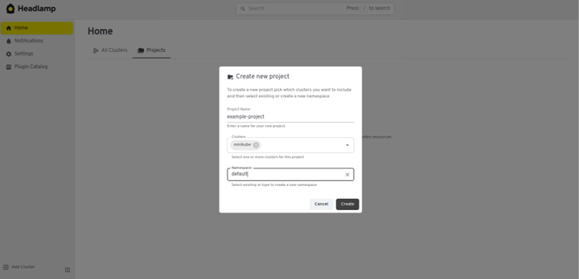
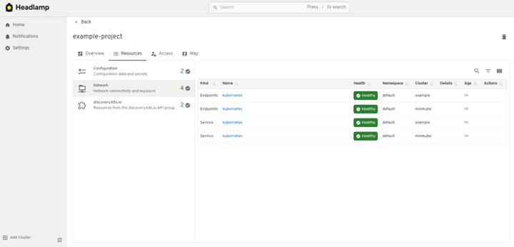
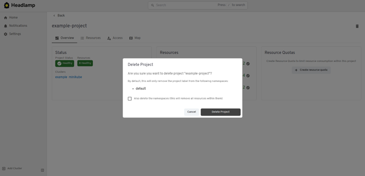

## View and Manage Kubernetes Applications with Headlamp Projects

Applications in Kubernetes are made up of multiple resources like pods, services, and deployments, often spread across namespaces. Without a way to group these resources, managing, troubleshooting, and collaborating can feel like piecing together a puzzle.

<!--truncate-->

Headlamp Projects (since version 0.35.0) gives you a single, application-centric view. Instead of navigating cluster-wide lists or searching for labels, you can organize related resources into logical groups. This makes it easier to understand and manage your app as a whole.

Headlamp started as a UI for Kubernetes operators, focusing on resources such as pods, services, ConfigMaps, and more. It even includes a Map view to visualize relationships. For developers, though, a resource-centric approach can feel indirect. Projects bridges that gap by providing a clear, application-first experience.

## Introducing Projects

To solve this, we introduced Headlamp Projects. Projects provide a flexible way to group related Kubernetes resources into a single, scoped view. Instead of jumping between namespaces or digging through YAML, you can organize everything that makes up an application across one or more namespaces and even multiple clusters into a project. This gives teams clarity, reduces resource sprawl, and makes collaboration easier.

Projects are built on top of Kubernetes, no special custom resources are needed, so you are still working with native resources like namespaces, deployments, and services. The difference is that Headlamp adds a visual layer that brings the project related resources together in one place, lowering the barrier to entry and making it easier for teams to manage applications without getting lost in cluster-wide complexity.

## Solving the Onboarding Bottleneck with Headlamp Projects

Headlamp Projects change that by giving teams a scoped, visual environment that lowers the barrier to entry. Instead of YAML files and manual RBAC configuration, a Dev Lead or Kubernetes Admin can create a project linked to the right namespaces and give developers a focused space to work all in just a few clicks.

Here is what you can do in the Headlamp UI:

### Create a New Project

Use a guided flow to name your project and define its scope. Projects are built on a label-based model, allowing you to group resources across one or more namespaces. This can of course be done in Headlamp's UI, or by applying the right labels to namespaces in whatever way a cluster administrator prefers.



### Import Existing Namespaces

Select existing namespaces or create new ones to associate with your project right from Headlamp's UI.


### Span Projects Across Clusters

Projects are not limited to a single cluster. You can group resources from multiple clusters into a single project, making it easier to manage workloads in hybrid or multi-cluster environments.


### Built-in RBAC Integration

Headlamp respects Kubernetes RBAC, so users only see and interact with resources they are allowed to manage. No extra configuration is required.

## Making Kubernetes Work for Developers

Once a project is created in Headlamp, developers can join and start deploying workloads with minimal friction. Everything is scoped to the project, so users only see what is relevant to their work, instead of having to navigate cluster-wide views. Headlamp respects Kubernetes RBAC permissions, so developers only see the resources they have access to. If a developer already has access to a namespace, once they use Headlamp to access that cluster, the project will automatically appear for them.

This is especially helpful for new developers or users coming from non-DevOps backgrounds. Instead of having to understand where to look in Kubernetes for their app, they can jump straight into deploying and monitoring their applications. Here is what the onboarding experience with Projects looks like:

### Monitor and Troubleshoot

The project view shows active workloads, logs, events, and metrics that are all scoped to the project. Developers can understand what is happening without needing to dig through cluster-wide data.



### Delete with a Single Click

Projects can be deleted with one click. This helps users start fresh or clean up after a learning session without needing help from an admin.



### Manage Multiple Environments

If you have separate environments for development, test, and production, you can create a project for each and link the relevant namespaces. This gives developers a clear, scoped view of the environment they are working in, reducing confusion and mistakes.

## Conclusion and Next Steps

Many Kubernetes users are application developers, and Kubernetes complexity often comes from organizational challenges, not just technical ones. Setting up environments, managing access, and helping new developers get started can take hours or even days. Headlamp Projects solves this by introducing scoped, visual environments that make onboarding and collaboration faster and easier.

By providing a simple, self-service way to group resources, Headlamp lowers the barrier to entry and makes Kubernetes more approachable for everyone. Dev Leads can create projects and organize resources in minutes, while developers can onboard and deploy without navigating cluster internals. New users can experiment safely and build confidence through guided workflows.

Whether you are running Azure Kubernetes Service (AKS), Elastic Kubernetes Service (EKS), or any other Kubernetes distribution, Headlamp Projects help your team move faster, collaborate better, and focus on building, not fighting the platform.

**Tip**: If you want to add an existing namespace to a project, simply apply the project label via Headlamp (editing the namespace directly), or you can also use _kubectl_, as:

```sh
kubectl label namespace <namespace-name> headlamp.dev/project-id=<project-id>
```

To get started, open Headlamp, select Projects in its home view, and create a new project to explore how it can simplify your Kubernetes experience.