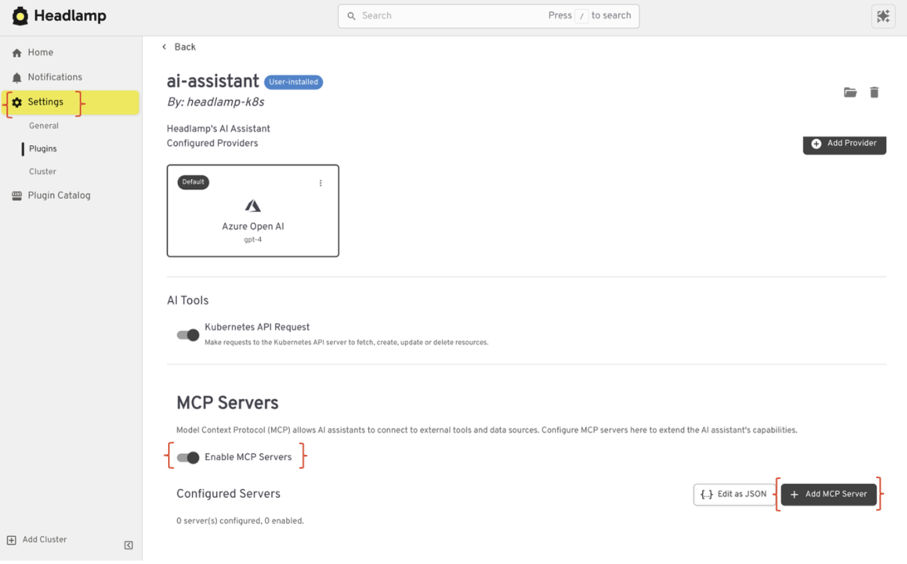
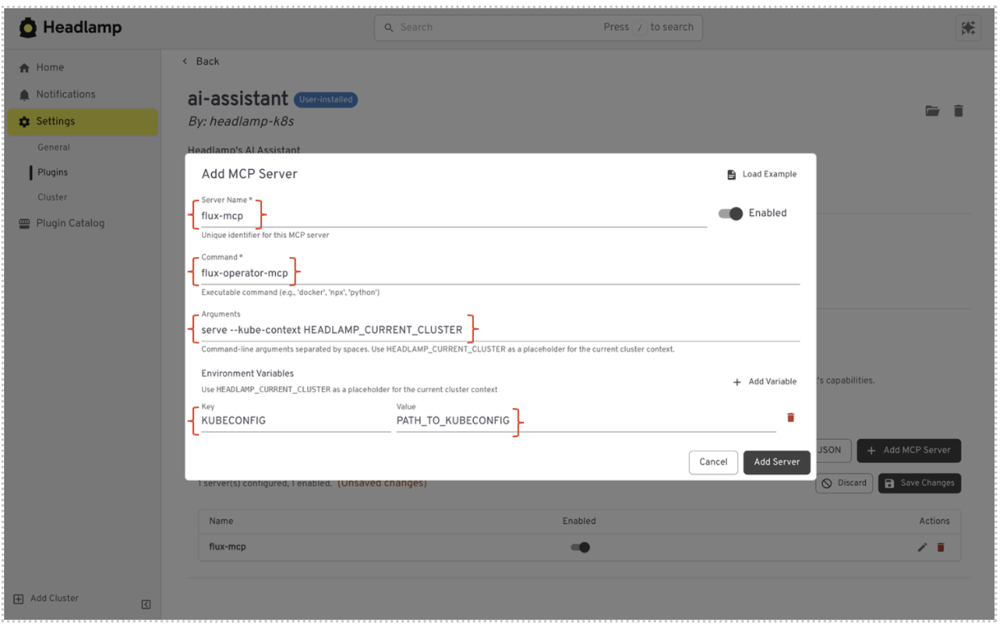

## The Problem

Kubernetes teams lose time switching between tools to understand what is happening in their clusters. Many tools offer deep insight, but that expertise often lives outside the UI where teams actually work. This breaks context and slows decisions. MCPs bring powerful expertise into Kubernetes workflows. They can explain how systems behave at runtime, how workloads interact, and where issues begin. But today, that expertise is usually accessed through separate tools or commands.

<!-- truncate -->

The challenge is not the MCPs themselves. It is where they live.

Teams move between dashboards, terminals, and scripts to get answers. They learn something in one place, then act somewhere else. Context gets lost along the way. Kubernetes is where applications run and where decisions are made. MCP expertise should live there too. In context. Next to the workloads and applications it describes.

## The Solution

Headlamp brings MCP expertise directly into the Kubernetes UI.

With MCP support, Headlamp makes specialized insight available where Kubernetes work already happens. Instead of accessing MCPs through separate tools, teams use them in context alongside their workloads. This reduces context switching, but it also does more than that. MCPs bring focused expertise into the UI. MCPs interpret the domains, behaviors, and systems they surface. Helping users to understand in a way that matches the Kubernetes resources on screen.

The workflow stays simple. You look at an application. You use an MCP to understand what is happening. You act without leaving Headlamp. By unifying MCP expertise inside the Kubernetes UI, Headlamp turns insight into something teams can use right away. Not something teams have to translate or chase down.

## What MCP Support Means in Headlamp

MCP support in Headlamp reduces context switching by making MCPs part of the Kubernetes workflow. MCPs are built in, not bolted on.

MCPs are available inside the same UI teams use to explore clusters, inspect workloads, and troubleshoot issues. Instead of switching tools, you interact with MCPs alongside Kubernetes resources. Their output appears next to the workloads and applications it describes, where it is easiest to understand. This does more than simplify access. MCPs bring focused expertise into the UI. They surface insight that shows how systems behave, components interact, and where problems start. That understanding is tied directly to Kubernetes context, not shown in isolation.

By treating MCPs as first‑class integrations, Headlamp keeps workflows simple. Kubernetes resources, application views, and MCP expertise live in one place. Teams spend less time stitching tools together and more time understanding what is happening.

## Why This Matters for Kubernetes Teams

Kubernetes is rarely managed by one role. Developers, operators, and platform engineers all work in the same clusters. However, they look at those clusters for different signals and ask different questions.

MCPs in Headlamp bring that expertise closer to the work.

**Developers** gain clearer insight into how their applications behave at runtime. MCPs help explain what is happening inside workloads, not just that something failed. This makes issues easier to understand and faster to fix.

**Platform engineers** benefit from consistency and control. MCP expertise shows up inside a familiar UI and follows existing Kubernetes permissions. Teams gain deeper operational understanding without adding another system to manage.

**Operators** see focused insight where investigations already happen. MCP output appears in the chat box alongside logs, events, and resource state, making it easier to connect signals and identify root causes.

By unifying MCP expertise inside the Kubernetes UI, Headlamp creates a shared understanding of the cluster. Teams spend less time translating between tools and more time solving problems together.

## MCPs in an Application‑Centric World

Headlamp helps teams think in terms of applications, not just individual Kubernetes resources. Projects group related workloads, services, and configurations into a single, scoped view.

MCP support enhances projects by bringing specialized insight into the same application context.

Instead of running MCPs across an entire cluster and sorting through results later, MCPs can be used where the application lives. Their expertise is applied to the namespaces, workloads, and resources that matter, not buried in cluster‑wide noise.

This makes MCP insight easier to understand and easier to trust. Teams see expert signals in the context of the application they are working on. The result is less distraction and more focus on what actually affects the app.

## Setting Up MCP Support

The Model Context Protocol (MCP) is an open standard that lets the Headlamp AI Assistant talk to external tools through a unified interface—think of it as a plugin system for your AI. Connect an MCP server (like the Flux operator) and its capabilities appear alongside Headlamp's built-in Kubernetes tooling, ready to use in chat.

### How it works

The Headlamp desktop app spawns MCP servers as local processes, discovers the tools they expose, and hands them to the LLM. When you ask a question that needs an external tool, the assistant picks the right one, runs it, and formats the results into tables, metrics, or plain text.

### Setting it up

1. Open the AI Assistant plugin settings and navigate to the **MCP Servers** section.
2. Turn **Enable MCP servers** on.

3. Click **Add Server**, then enter a name, the server command, and any args or environment variables it needs.

**Example:**

- **Name** — A unique identifier for the server.
- **Command** — The executable to run (e.g., `flux-operator-mcp`).
- **Args** — Command-line arguments (e.g., `serve --kube-context HEADLAMP_CURRENT_CLUSTER`).
- **Environment Variables** — Optional env vars required by the server (e.g., `KUBECONFIG`).

4. **Save.** Headlamp will spawn the process and discover its tools. Review and toggle individual tools under the **MCP Tool Settings** tab.

After that, just ask a question. For example, _"List all Flux HelmReleases in the default namespace"_—and the assistant takes care of the rest.

A few things worth noting: MCP is desktop-only (Electron), you need at least one AI provider configured, and you can run multiple servers side by side. Tool approval settings let you gate write operations before they execute.

## Use Cases That Fit Well

MCP support in Headlamp works best when teams need expert insight in context.

Some MCPs focus on how applications behave at runtime. For example, the Inspektor Gadget MCP can surface low‑level signals from running workloads. When used in Headlamp, those signals are tied directly to pods and namespaces. Teams see how an application behaves while it is running, not just that something is wrong.

Other MCPs focus on how applications are delivered and kept in sync. The Flux MCP brings insight into deployment state, drift, and reconciliation. Instead of checking a separate system, teams can understand why a workload looks the way it does right from the Kubernetes UI.

In both cases, the value is not just access to data. It is access to expertise. MCPs explain what is happening and why, in the context of the application teams are already working on. By keeping that expertise inside Headlamp, teams spend less time chasing answers across tools and more time acting on what they learn.

## Conclusion

MCPs bring more than raw signals. They bring expertise. They understand how systems behave, how applications are delivered, and where problems begin.

Headlamp brings that expertise into the Kubernetes UI. MCP insights show up where teams already work, tied to real workloads and applications. Context stays intact. Decisions get easier. Action follows faster.

This is about more than reducing context switching. It is about giving Kubernetes teams smarter operational intelligence. Intelligence grounded in the domain knowledge MCPs provide and delivered in a way that fits how teams actually work.

This is also part of a longer journey. We are building Headlamp toward a Unified Kubernetes Workspace. One place where ease of use, context, insight, and action come together, so Kubernetes feels connected instead of fragmented.
