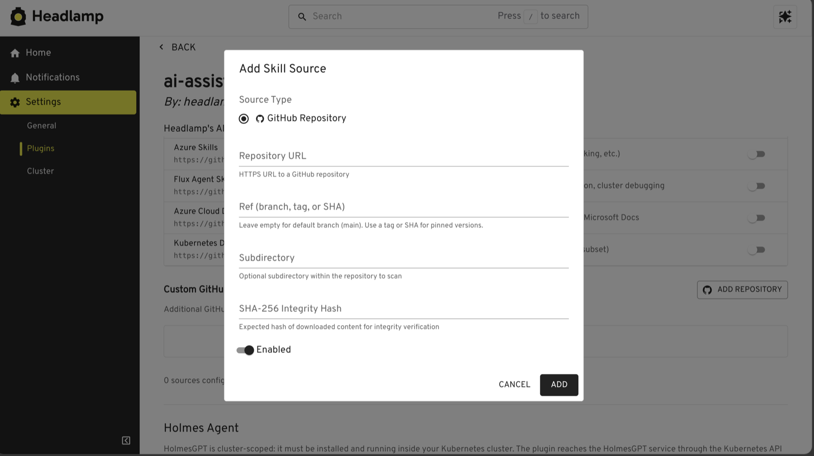
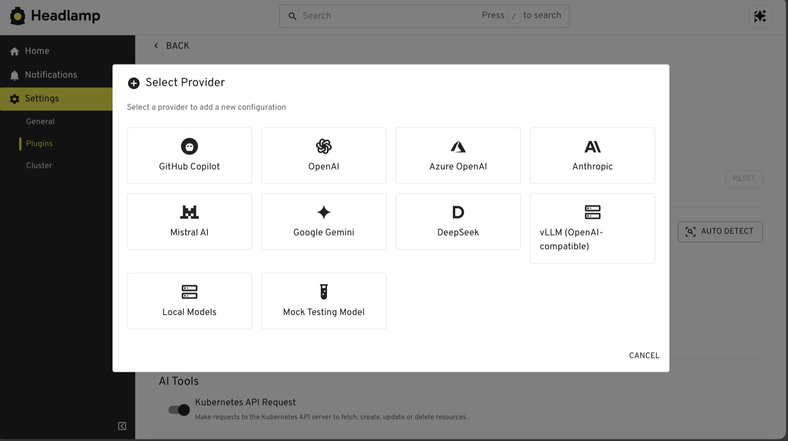
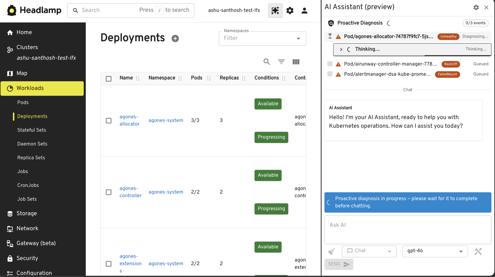

[Headlamp AI Assistant](https://github.com/headlamp-k8s/plugins/tree/main/ai-assistant),
an open source Headlamp plugin maintained under Kubernetes SIG UI, adds a
conversational interface to Headlamp. It can inspect cluster state and request
changes. That access requires clear trust boundaries, predictable cluster targeting,
provider choice, accessibility, and tests that do not depend on a live model.

<!-- truncate -->

## Add organization-specific knowledge without rebuilding the plugin

The 0.3.0-alpha release introduced *skills*, which are versioned sources of an
organization's instructions and reference information from GitHub repositories. The
assistant can inspect a skill, match it to a request by keywords or embeddings, and
add the relevant content. Users can pin a source to a branch, tag, or commit SHA and
verify it with a SHA-256 integrity hash.

The loader rejects path traversal and symbolic links, restricts supported protocols,
and limits archive size and file count. Skill content becomes part of the model's
instruction context. Review that content, pin production sources to an immutable
revision, and use the integrity field for sources outside your control.

The same release expanded
[Model Context Protocol (MCP)](https://modelcontextprotocol.io/) support. Desktop
users can configure MCP servers, discover their tools, inspect input schemas, and
enable tools individually. Servers that use `HEADLAMP_CURRENT_CLUSTER` restart when
the active cluster changes. HolmesGPT integration also became configurable and now
checks service health before switching into agent mode, preserving a pending prompt
when the service is unavailable.

Skills add organization-specific knowledge without changing the plugin. MCP servers
add tools.

## Auto-detect available models

In the desktop application, **Auto Detect** finds model access that is already
available on your computer. It currently discovers:

- GitHub Copilot through GitHub command-line authentication
- Local Llama and other models exposed through Ollama
- Azure OpenAI and Azure AI Foundry chat deployments across enabled Azure
  subscriptions

For detected Azure deployments, the plugin checks access before saving them. It
reports missing role-based access control permissions and private-network
connectivity problems separately, which helps explain why a discovered Azure model
might not be usable. The Azure detector retrieves account keys when needed but does
not persist them.

Manual configuration remains available for other hosted, local, and
OpenAI-compatible providers. Support for more automatic discovery sources is
planned.

Provider choice does not remove the need for a data review. Depending on the tools
and provider that you enable, prompts can include Kubernetes resource data and tool
results. Before using the plugin, review the model provider's data-handling terms,
the enabled tools, and the access granted to the Headlamp session.

## Diagnose problems as they happen

Without proactive diagnosis, an investigation starts after you open the assistant
and ask for help. Depending on the agent and tools involved, gathering context and
returning an answer can take several minutes.

After you sign in to Headlamp and open the assistant with proactive diagnosis
enabled, the plugin checks recent warning and error events and starts investigating
automatically. You do not need to enter a prompt first. While the panel remains open,
the plugin periodically checks for more events and can prepare summaries of affected
workloads and suggested follow-up questions.

The current preview does not run while the assistant panel is closed. Proactive
diagnosis remains an opt-in alpha preview and is off by default. Feedback from early
users is guiding further improvements to when investigations start, how results are
prioritized, and how progress is presented.

The longer-term goal is to save time during troubleshooting by starting an
investigation earlier. When a user needs to diagnose an issue, the agent should
already have examined the issue and prepared useful context instead of beginning
from scratch.

## Improve accessibility and internationalization

The shared UI work also added keyboard controls for resizing and dialogs, accessible
names and status announcements, stronger dialog semantics, and theme-aware code
rendering. Automated component tests include axe checks. These checks do not show
complete Web Content Accessibility Guidelines (WCAG) conformance. A separate fix
made the top-bar icon readable against light, dark, and custom navigation themes.

Internationalization work connected the shared UI to Headlamp's translation
instance and made production strings extractable. The plugin now has locale catalog
support for English and 18 additional locales. The UI translates display labels
without changing the canonical prompt sent to a model.

## Improve quality through shared packages, tests, and documentation

Contributors separated the assistant into four parts:

- `ai-common` contains provider, conversation, prompt, skill, tool, MCP, and security
  behavior.
- `ai-ui` contains reusable React components, settings, accessibility behavior, and
  rendering.
- The Headlamp plugin code connects the shared packages to Headlamp, Kubernetes
  resources, plugin settings, and the desktop application.
- The standalone `headlamp-ai` command-line interface uses the same core without the
  Headlamp UI.

This structure makes the shared behavior testable without loading Headlamp and gives
each package a defined public interface. It also centralizes secret redaction, tool
approval, cancellation, and provider configuration.

Resource updates now use Kubernetes merge semantics instead of merging live objects
in the browser. The tool layer also redacts common credentials and keeps added tool
authority configurable. Contributors use the CLI to test providers, skills, and
Kubernetes tools outside the Headlamp UI. Fixture-backed chat models, scripted
agents, mock tools, and offline conversations make tests reproducible and avoid
spending model tokens during routine development.

Automated coverage now includes package and plugin unit tests, axe accessibility
checks, and end-to-end scenarios that use KWOK and Playwright. The main README
documents provider, HolmesGPT, and MCP configuration. A separate end-to-end guide
documents how to build the plugin, create the test cluster, and run the Playwright
scenarios.

## Make multi-cluster context explicit

From the Home view, the assistant now receives the available clusters and can target
one by name. It selects a default only when one cluster is configured and includes
the target cluster in write confirmations. You can discuss resources in multiple
configured clusters from one conversation without navigating into each cluster
first.

## Try it and contribute

The AI Assistant remains **alpha software**, but it is already useful for asking
questions about cluster state, gathering context, and starting guided
investigations in Headlamp. Over the past six months, shared packages, broader
automated and end-to-end tests, clearer documentation, and more predictable provider
and cluster handling have improved its quality.

Model output can still be wrong. Review the cluster, namespace, resource, and patch
before approving a write. Start with read-only tools and a non-production cluster
while evaluating the plugin.

Installation and configuration instructions are in the
[AI Assistant README](https://github.com/headlamp-k8s/plugins/blob/main/ai-assistant/README.md).
To report a problem or propose an improvement, use the Headlamp plugins repository's
[issue tracker](https://github.com/headlamp-k8s/plugins/issues). Contributions to
provider support, evaluation fixtures, accessibility, documentation, and
Kubernetes-specific safety behavior are welcome.
