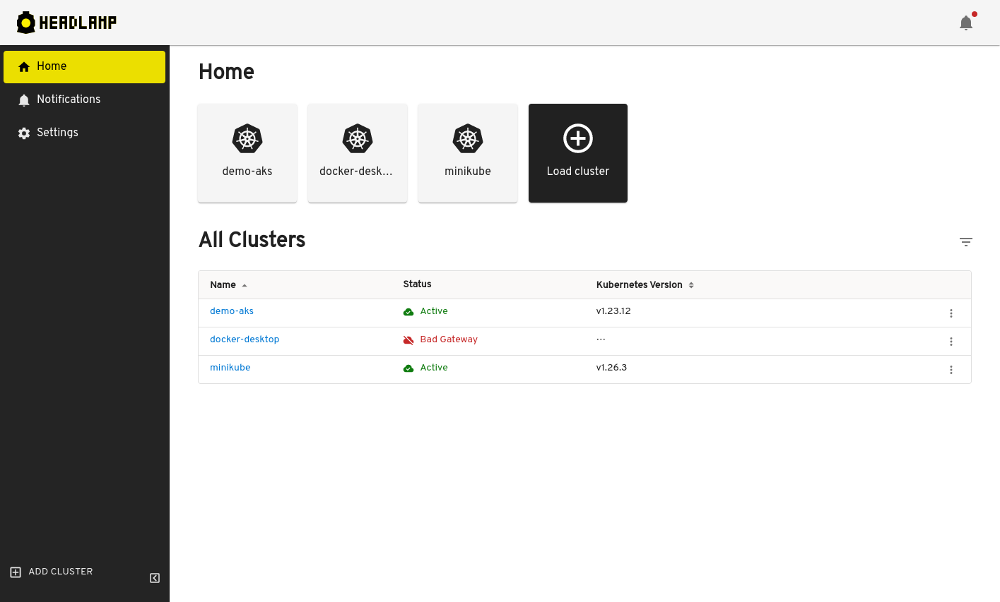
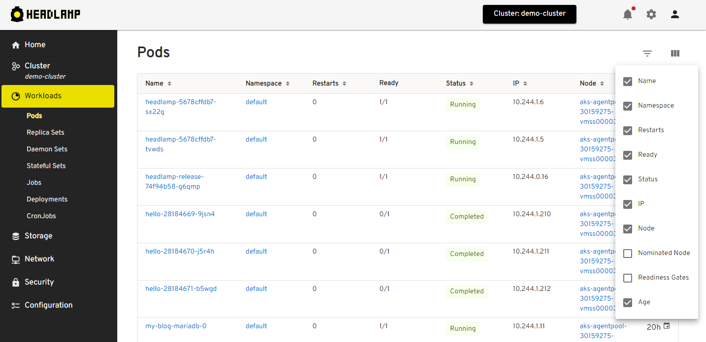

+++
authors = ["joaquim-rocha"]
date = "2023-08-03T17:00:00+01:00"
description = "Headlamp 0.19.0: A new home, with a cleaner UI"
draft = false
tags = ["kubernetes", "ui", "headlamp", "plugins"]
title = "Headlamp 0.19.0: A new home, with a cleaner UI"
postImage = "moderntrain.jpg"
+++

We are excited to announce the release of [Headlamp 0.19.0](https://github.com/headlamp-k8s/headlamp/releases/tag/v0.19.0), the latest version of our web UI for Kubernetes. This release brings some major improvements to the user experience, as well as some new features that make working with Kubernetes easier and more efficient. In this blog post, we highlight some of those new features.

## Home sweet home

One of the most noticeable changes in this release is the new home view, which replaces the previous cluster chooser dialog and provides a quick overview of the clusters you have configured, as well as their status.

While we have this new home view and it can surely be used to select the desired cluster, we have also changed the cluster chooser to be a dropdown instead of a dialog, allowing for a quicker move into a different cluster.

Multi-cluster support is a major feature in Headlamp, and we will keep improving this new view with more capabilities to help manage multiple clusters, over the new next months.

## UI redesign and more Kubernetes information

Another big improvement is the revamped UI, which has a cleaner and more modern look and feel. One of the goals of this new look was to allow for more information to be displayed, as showing more details from resources in each list view has been a common request from Headlamp’s users. With that in mind, we have added more columns for each Kubernetes resource list view, trying to cover the ones given by the `kubectl get .. -o wide` option. Whenever the list view couldn’t or shouldn’t show those columns by default, we have still included them as hidden by default, but they can easily be shown by using the new columns-chooser button.

This way, you can see more information about your resources at a glance, without having to switch to the details view.

## Get the new Headlamp

These are just some of the highlights of Headlamp 0.19.0. There are many more bug fixes and enhancements that you can find in the [release notes](https://github.com/headlamp-k8s/headlamp/releases/tag/v0.19.0).

If you haven’t tried Headlamp, check out the instructions on how to install it as either a [desktop application](https://headlamp.dev/docs/latest/installation/desktop/), or [in-cluster](https://headlamp.dev/docs/latest/installation/in-cluster/).

We hope you enjoy using Headlamp and find it useful for managing your Kubernetes clusters. We welcome your feedback and suggestions on how we can make Headlamp even better. You can reach us on [GitHub](https://github.com/headlamp-k8s/headlamp), [Slack](https://kubernetes.slack.com/messages/headlamp), [Mastodon](https://fosstodon.org/@headlamp) or [Twitter/X](https://twitter.com/headlamp_ui).

Thank you for using Headlamp and stay tuned for more updates!