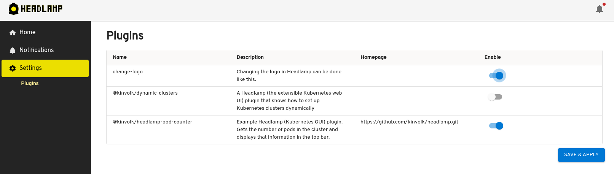
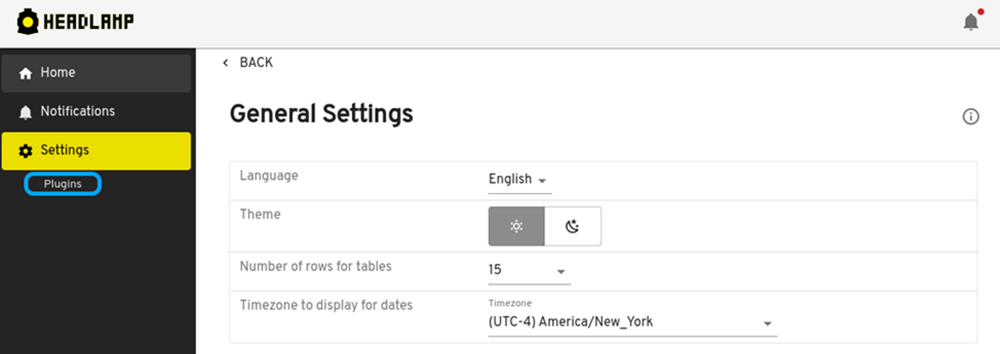
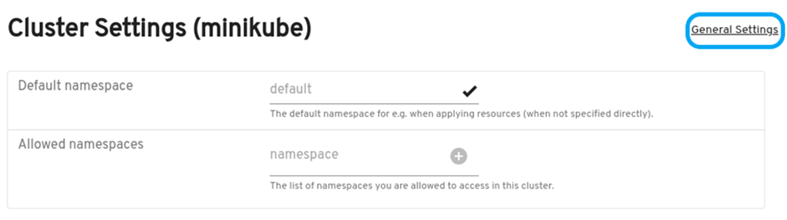
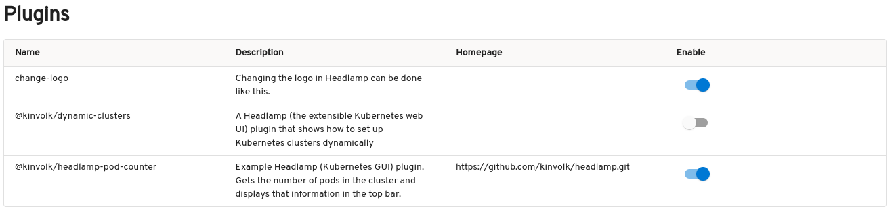

+++
authors = ["vincent-t"]
date = "2023-09-21T16:30:00+01:00"
description = "Plugin Management UI"
draft = false
tags = ["kubernetes", "ui", "headlamp", "plugins"]
title = "Plugin Management UI"
postImage = "splash.jpg"
+++

Welcome to another exciting update from the Headlamp project! We're thrilled to introduce
our latest addition -- the Plugin Management feature, a native Headlamp tool for managing
plugins in your Kubernetes cluster. As we discussed in our previous blog post, plugins are
essential for enhancing the functionality and efficiency of Headlamp, and therefore your
Kubernetes experience.

The Plugin Management feature also represents a change in what kind of information
Headlamp accesses from its plugins. Before version 0.17.0, Headlamp’s focus lay
exclusively on the JS file, which contained the functional elements of the plugin. This
model, while effective, was limited in terms of the information accessed. To capture
additional metadata like version compatibility, origin, and descriptions, a new
_package.json_ file has been integrated into the plugin structure, alongside the original
JS file.

Utilizing these expanded data attributes, the Plugin Management feature presents a
comprehensive view of each plugin, including its name, description, and homepage.
Furthermore, a user-friendly switch is integrated to allow quick visualization and
modification of a plugin’s enabled or disabled state, as demonstrated in the following
screenshot.

## Overview of the Plugin Management Feature

Currently, the Plugin Management feature is exclusive to the Headlamp desktop application.
This is informed by the differing use-cases of plugins in web and desktop scenarios. In a
web setting, the deployed plugins reflect the operator's intent for a uniform user
experience. On the desktop, however, users have the freedom to tailor their experience as
they see fit. We are open to the possibility of universalizing this feature across
platforms in the future and welcome your interest and input.

## Accessing the Plugin Management Feature

_Dashboard navigation_

* Navigate to the main dashboard by clicking the "Home" button located at the top of the
sidebar navigation options.
* From the Home dashboard page Click on the "Settings" sidebar navigation option to go to
the General Settings page.
* While at the General Settings page, click "Plugins" inside of the "Settings" submenu
navigation option.

_Top bar navigation (while in a cluster context)_

* Navigate to the settings page by clicking the gear icon located at the top right corner
of the screen.
* From this settings page, click the "General Settings" link to the right of the page.
* While at the General Settings page, click "Plugins" inside of the "Settings" submenu on
the left of the page.

## Organized List of Plugins

The Plugin Management feature delivers an organized catalogue of Headlamp plugins,
effectively improving user navigation and selection. By organizing the interface, users
are free to focus on the critical aspects of their Kubernetes deployments. Important
details like 'Name,' 'Description,' 'Homepage,' and 'Enable' toggle are clearly displayed
for each plugin, thus aiding users in effective plugin management. A sample screenshot
below illustrates this organized presentation.

## Integration with Headlamp's Existing Features and Workflow

Extending Headlamp with plugins is a major focus of the project. Thus, being able
to manage plugins is an essential task. Adding this feature to your Headlamp-equipped
Kubernetes cluster assures a more streamlined and effective user experience with our aim
to provides users and plugin developers alike with more granular control and effective
management of their environments.

In future releases, we intend to roll out capabilities for discovering, updating and
removing plugins. We highly value your thoughts and encourage you to delve into this new
feature.
