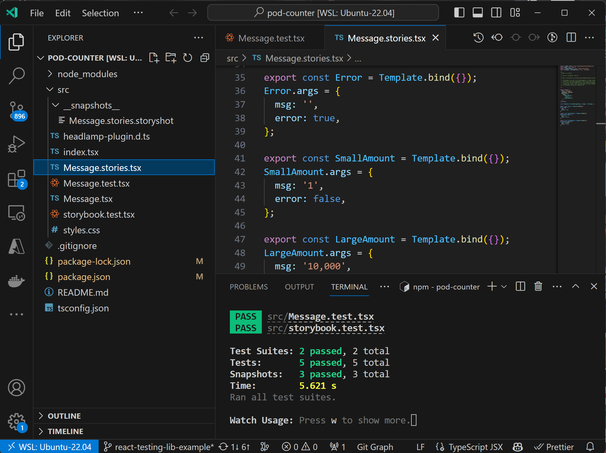
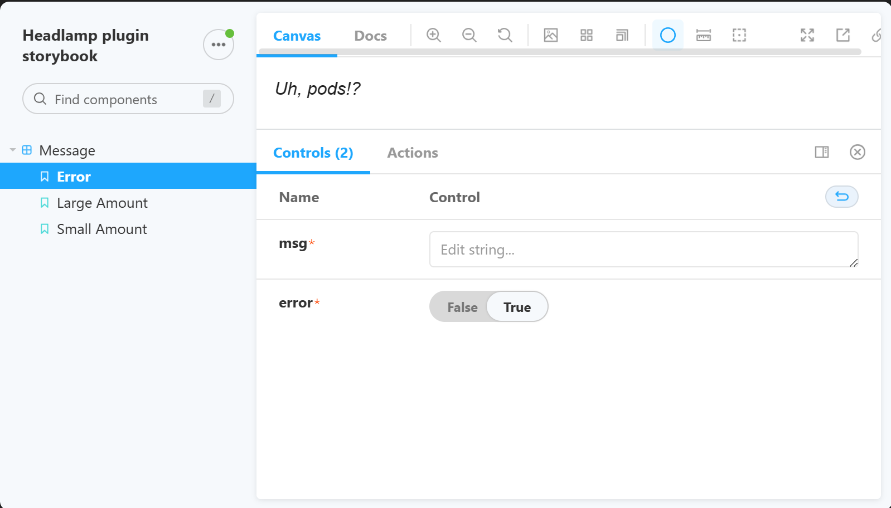

+++
authors = ["rene-dudfield"]
date = "2023-11-07T10:00:00+02:00"
description = "Testing Headlamp plugins"
draft = false
tags = ["kubernetes", "ui", "headlamp", "plugins", "testing"]
title = "Testing Headlamp plugins"
postImage = "splash.jpg"
+++


*Here is vscode and the test runner showing all tests pass.*

As an extensible Kubernetes UI, developers can use plugins to add features, change functionality and even create a fully custom Kubernetes experience.  To learn more about what plugins can do, please see the documentation.

As plugins are designed to be independently developed, they  are their own code that lives outside of the Headlamp codebase. Independent code needs independent tests. So, how do you test your plugins? How do you test them on CI (with github actions)? Read on to learn how.

## Two Types of Testing

This post will cover two types of testing that Headlamp plugin authors can do.

1. Storybook with Snapshot Testing: Storybook snapshots capture the UI components’ rendered output and offer a platform to visually browse and interact with components in different states. Why is this useful? They aid in visual verification, regression detection, enhance collaboration through a visual component catalog, and allow interactive viewing of various component states. If you're not familiar with Storybook, check out what it is about at https://storybook.js.org/tutorials/intro-to-storybook/. We also show some examples below of what stories look like.

2. Jest with React Testing Library: This library offers helper functions for testing React components from the user’s perspective, focusing on usability and accessibility. Why is this useful? It ensures user-friendly applications, promotes resilient test cases, and supports both unit and integration testing for comprehensive coverage. You can find out more about React Testing Library at https://testing-library.com/docs/react-testing-library/intro/. See below for an example of what testing with Jest and React Testing Library looks like.

_Note:_ It may be nice to know that both of these testing methods are used by Headlamp internally to test components. Even though plugins live outside of the Headlamp codebase, they can use these same methods of testing.

## 1. Storybook Snapshot Test Example

Here are three story variants defined for the "Message" component in the [pod-counter example plugin](https://github.com/headlamp-k8s/headlamp/blob/main/plugins/examples/pod-counter/src/Message.stories.tsx). Namely "Error," "SmallAmount," and "LargeAmount," with different props to showcase the component's behavior and appearance under various conditions and states.


*Here is the storybook interface showing the different states for the Message component in isolation.*

As you can see, you get an interface for visually testing and manually user testing components. At the same time these tests can be used as regression tests, and you can see the html that is generated for different states too.

```typescript
import { Meta, Story } from '@storybook/react/types-6-0';
import React from 'react';
import { MemoryRouter } from 'react-router-dom';
import Message, { MessageProps } from './Message';

export default {
  title: 'Message',
  component: Message,
  decorators: [
    Story => (
      <MemoryRouter>
        <Story />
      </MemoryRouter>
    ),
  ],
} as Meta;

const Template: Story<MessageProps> = args => <Message {...args} />;

export const Error = Template.bind({});
Error.args = {
  msg: '',
  error: true,
};

export const SmallAmount = Template.bind({});
SmallAmount.args = {
  msg: '1',
  error: false,
};

export const LargeAmount = Template.bind({});
LargeAmount.args = {
  msg: '10,000',
  error: false,
};
```

## 2. React Testing Library

[React Testing Library](https://testing-library.com/docs/react-testing-library/intro) is a popular way to test react components.

Here's an example of a [Message.test.tsx](https://github.com/headlamp-k8s/headlamp/blob/main/plugins/examples/pod-counter/src/Message.test.tsx) file for testing a Message component.


```tsx

// A react testing lib example test for the Message component.
// @see https://testing-library.com/docs/react-testing-library/intro

import '@testing-library/jest-dom';
import { render, screen } from '@testing-library/react';
import userEvent from '@testing-library/user-event';
import Message from './Message';

describe('Message', () => {
  it('renders a message', async () => {
    // Arrange
    render(<Message msg="Hello World" error={false} />);

    // Act
    //   Clicking on this doesn't do anything, but it's a good example of how to
    //   find a button by its text.
    await userEvent.click(screen.getByText('# Pods: Hello World'));

    // Assert
    expect(screen.getByText(/# Pods: Hello World/i)).toBeInTheDocument();
  });

  // A test showing the error=true state
  it('renders an error message', async () => {
    // Arrange
    render(<Message msg="Hello World" error />);

    // Act
    await userEvent.click(screen.getByText('Uh, pods!?'));

    // Assert
    expect(screen.getByText(/Uh, pods!?/i)).toBeInTheDocument();
  });
});

```

## Executing Plugin Tests Using GitHub Actions

Now we will look at the process of configuring a GitHub Actions workflow to test your plugin automatically within a GitHub repository. The subsequent YAML configuration is adapted and simplified from GitHub’s official [Building and Testing Node.js](https://docs.github.com/en/actions/automating-builds-and-tests/building-and-testing-nodejs) documentation.

If you use a different CI system, this should give you an idea on how to get started.

Does it pass the checks for test, lint, formatting, type checking and building? See below.

Create a new file named `.github/workflows/headlamp-plugin-github-workflow.yaml` at the root of your repository and insert the following YAML content:

```yaml
name: Headlamp plugin linting, type checking, and testing

on:
  push:
    branches: [ main ]
  pull_request:
    branches: [ main ]

jobs:
  build:

    runs-on: ubuntu-latest

    defaults:
      run:
        working-directory: ./your-folder-of-plugins

    strategy:
      matrix:
        node-version: [18.x]

    steps:
      - uses: actions/checkout@v3
      - name: Use Node.js ${{ matrix.node-version }}
        uses: actions/setup-node@v3
        with:
          node-version: ${{ matrix.node-version }}
      - run: npx @kinvolk/headlamp-plugin lint .
      - run: npx @kinvolk/headlamp-plugin format --check .
      - run: npx @kinvolk/headlamp-plugin tsc .
      - run: npx @kinvolk/headlamp-plugin test .
      - run: npx @kinvolk/headlamp-plugin build .
```

This configuration sets up a workflow for linting, type checking, testing, and building your Headlamp plugin, and it is triggered on every push or pull request event to the main branch. Ensure that you replace ./your-folder-of-plugins with the actual path where your plugins are located.

For an in-depth understanding and customization options of GitHub workflows and actions, refer to the official [GitHub actions documentation](https://docs.github.com/en/actions).

## Conclusion

Testing Headlamp plugins is a key part of making strong and effective adaptations to the Headlamp user interface. Using tools like Storybook and React Testing Library makes sure that the plugins work well, are easy to use, and can be accessed by users. With GitHub Actions, testing is automated. So, every time code is added or changed, it's checked to make sure it's of high quality, works properly, and performs well. This thorough way of testing gives developers the confidence to add more features to the Headlamp user interface, knowing they are reliable and work in different situations.
