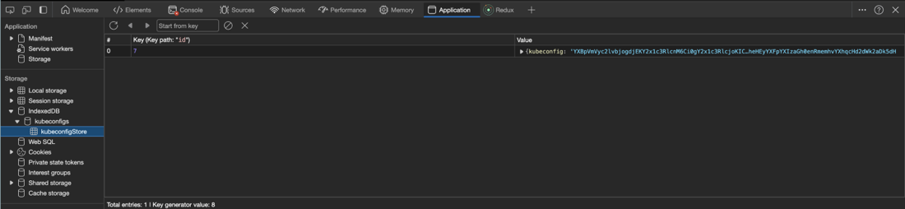
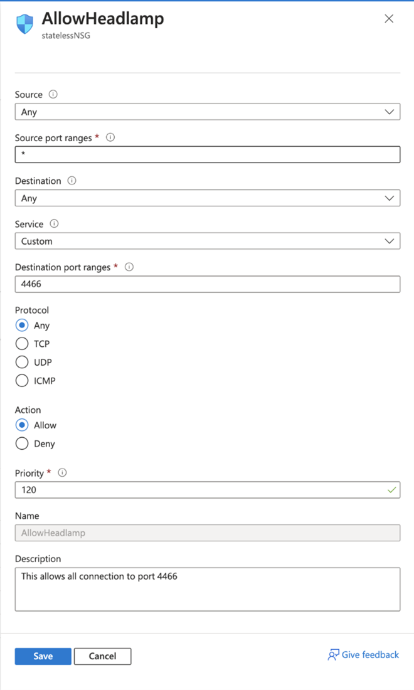
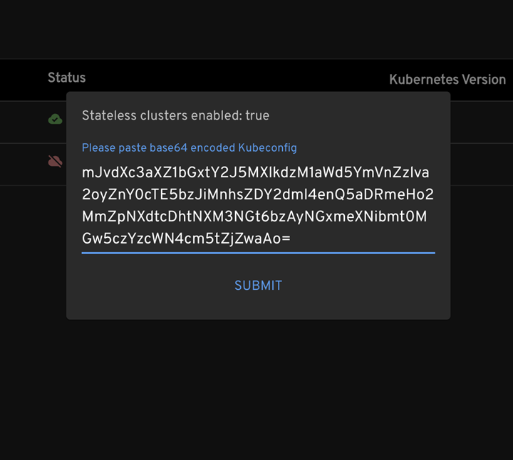
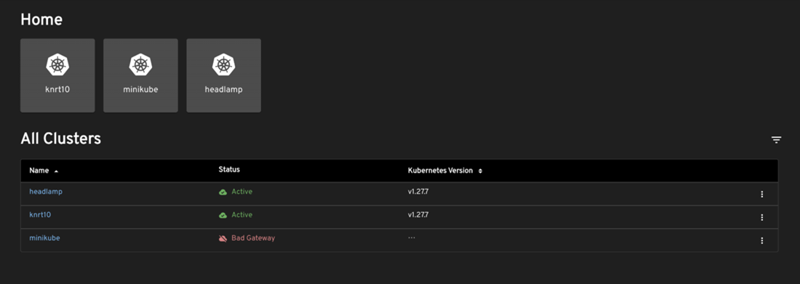

+++
authors = ["kautilya-tripathi"]
date = "2024-04-09T10:00:00+00:00"
description = "User-added Cluster Support in Shared Headlamp Deployments"
draft = false
tags = ["kubernetes", "ui", "headlamp", "cncf"]
title = "User-added Cluster Support in Shared Headlamp Deployments"
postImage = "splash.png"
+++

Headlamp supports running as both a [desktop application](/docs/latest/installation/desktop/) and as a [web service in-cluster](/docs/latest/installation/in-cluster/). Each environment has its own set of characteristics and limitations. One characteristic of the in-cluster deployment is that it can provide shared access. This shared access poses issues with security and privacy. For this reason, we enabled the ability to add/remove clusters only for the desktop version of Headlamp, as it is, by definition, a single user instance.  This meant, for example, that users were not able to add or modify which clusters would show, when using Headlamp as a web service. This is a limitation that we wanted to overcome to support a variety of very valid use cases.

The crux of the issue was that configuration contained state that when modified effected all users. After some consideration, we decided that the clearest path to removing this limitation was to remove the cluster configuration from residing on the Headlamp backend. This blog post will introduce how headlamp now supports multi-cluster support for multi-user in-cluster deployments.

## What is stateless cluster management?

Before, when users wanted to create a new cluster, they had to provide name and server details, which Headlamp used to create a kubeconfig and proxy, and then stored these credentials in the backend cache. However, this method had security implications if we enabled it in a shared environment. Without an authentication system built into Headlamp, there could be two consequences. Firstly, any clusters added became visible to all users. Secondly, the lack of authentication enabled potential denial-of-service attacks, as the system was exposed to endless creation of new clusters.

With stateless cluster management, we move critical operations to the client side (frontend). This new method avoids the aforementioned security issues. When a user loads their kubeconfig in Headlamp, it avoids the backend cache and uses the client-side abilities of the browser's indexDB instead. This not only avoids sharing data from the backend, but also brings scalability benefits, as indexDB's size grows with the user's device, preventing the risk of reaching memory limits.



## Deploying Headlamp in a VM (virtual machines) and exposing it securely

To deploy Headlamp on a VM (in this example, in Azure), we have created a script for setting up the VM in Azure and use a ssh key pair to access it securely.

* Use this command to run the script:

```bash
curl -sSfL https://headlamp.dev/blog/2024/03/user-added-cluster-support-in-shared-headlamp-deployments/create-azurevm.sh   | bash
```

* To run headlamp using docker-compose, install the required packages by running this command inside the VM.

```bash
curl -sSfL https://headlamp.dev/blog/2024/03/user-added-cluster-support-in-shared-headlamp-deployments/install-docker-amd64.sh | bash
```

* Execute the following command inside the VM to start Headlamp with the dynamic-clusters plugin (which sets up the UI for loading a kubeconfig) using docker-compose

```bash
curl -sSfL https://headlamp.dev/blog/2024/03/user-added-cluster-support-in-shared-headlamp-deployments/docker-compose-headlamp-run.sh | bash
```

* In the Azure portal, make an NSG (network security groups) rule that permits incoming connection only to port 4466.



* Now we need a kubeconfig with at least one cluster. So, if you do not have one, you can run the following script to make an AKS (Azure Kubernetes Service) cluster and get the kubeconfig value in base64 format from the output.

```bash
curl -sSfL https://headlamp.dev/blog/2024/03/user-added-cluster-support-in-shared-headlamp-deployments/aks-kubeconfig.sh | bash
```

## Creating stateless clusters

* In Headlamp, press the New Cluster button and insert the kubeconfig that you copied from the previous output and then press the submit button.



* After you press submit, the home view will show the new cluster (together with any other clusters you may have had already).



## Conclusion

The use of stateless clusters in Headlamp's web service architecture has helped us overcome this limitation as mentioned. By keeping cluster data locally in the user's browser, we improve privacy and scalability, which are vital issues in any shared deployment. This progress not only solves key user scenarios but also creates opportunities for ongoing platform enhancement and innovation, e.g. a plugin that logs users into a public cloud and sets up the user’s Kubernetes clusters in Headlamp automatically. We look forward to seeing what Headlamp plugin developers will do with this new feature.
